<center>


**UNIVERSIDAD PRIVADA DE TACNA**

**FACULTAD DE INGENIERÍA**

**Escuela Profesional de Ingeniería de Sistemas**

**Proyecto *DBCanvas — Generador de Diagramas de Base de Datos***

Curso: *Base de Datos II*

Docente: *Mag. Patrick Cuadros Quiroga*

Integrantes:

***Zapana Murillo, Kiara Holly (2023077087)***

***Vargas Espinoza, Jefferson Alfonso (2023076820)***

**Tacna – Perú**

***2026***

</center>

***

Sistema *DBCanvas — Database Diagram Generator*

Informe de Arquitectura de Software

Versión *2.0*

| CONTROL DE VERSIONES | | | | | |
| :-: | :- | :- | :- | :- | :- |
| Versión | Hecha por | Revisada por | Aprobada por | Fecha | Motivo |
| 1.0 | KHZM / JAVE | | | Abril 2026 | Versión Original — Arquitectura monorepo Go + React + Electron |
| 2.0 | KHZM / JAVE | | | Mayo 2026 | Actualización — Web App Next.js 14 + Supabase + React Flow + Version Control |

***

## ÍNDICE GENERAL

1. Introducción
   - 1.1 Propósito
   - 1.2 Alcance
   - 1.3 Definiciones y Siglas
   - 1.4 Cambios respecto a v1.0
2. Representación Arquitectónica
   - 2.1 Patrón Central: Pipeline de Transformación
   - 2.2 Estilo Arquitectónico: Monorepo con Packages Compartidos
   - 2.3 Estructura interna de apps/web
3. Metas y Restricciones Arquitectónicas
4. Vista Lógica
   - 4.1 Diagrama de Clases — SchemaModel
   - 4.2 Diagrama de Clases — Entidades de Dominio
   - 4.3 Diagrama de Clases — Componentes React
   - 4.4 Diagrama de Base de Datos (Drizzle Schema)
   - 4.5 Diagrama de Componentes del Monorepo
   - 4.6 Secuencia — Parseo y Render
   - 4.7 Secuencia — Autenticación
   - 4.8 Secuencia — Colaboración Realtime
   - 4.9 Secuencia — Version Control
   - 4.10 Secuencia — Export de diagrama
5. Vista de Procesos
   - 5.1 Cobertura de tipos de base de datos
   - 5.2 Pipeline de parseo multi-dialecto
   - 5.3 Ciclo de vida de un diagrama
   - 5.4 Flujo de autenticación y sesión
6. Vista de Despliegue
   - 6.1 Opción A — VPS con Docker + Nginx
   - 6.2 Opción B — Vercel
   - 6.3 Variables de entorno
7. Vista de Infraestructura
   - 7.1 Diagrama de infraestructura completo
   - 7.2 GitHub Actions — Workflows
   - 7.3 Análisis con Terraform

***

## 1. Introducción

### 1.1 Propósito

Este documento proporciona una visión arquitectónica completa del sistema **DBCanvas — Generador de Diagramas de Base de Datos**. Describe las decisiones de diseño estructurales, los patrones aplicados, la interacción entre componentes, la base de datos, los flujos de proceso y la infraestructura de despliegue, tomando como base el código real implementado en el repositorio del proyecto.

El objetivo es que cualquier desarrollador nuevo pueda comprender el sistema en su totalidad leyendo este documento, y que sirva de referencia para las decisiones de extensión futura como la Desktop App (roadmap v1.0).

### 1.2 Alcance

Este documento describe la arquitectura de la **Web App** de DBCanvas en su estado actual (v0.3), que incluye:

- Pipeline `DDL/JSON → SchemaModel → React Flow` ejecutado 100% en el navegador
- Autenticación con Supabase Auth (JWT)
- Persistencia de diagramas con Drizzle ORM sobre PostgreSQL (Supabase)
- Canvas drag & drop con React Flow: nodos de tabla personalizados y edges de relación FK
- Colaboración en tiempo real mediante Supabase Realtime (WebSockets)
- Sistema de version control integrado (commits, historial, restaurar, comparar)
- Export a PNG, SVG y Mermaid `.mmd`
- Deploy con Docker + Nginx sobre VPS o Vercel

Queda fuera del alcance de esta versión la Desktop App (Electron + Go), que está documentada en el roadmap como milestone v1.0.

### 1.3 Definiciones y Siglas

| Sigla / Término | Definición |
| :-- | :-- |
| **ERD** | Entity-Relationship Diagram — diagrama visual de la estructura de una base de datos |
| **DDL** | Data Definition Language — instrucciones SQL para definir estructuras (`CREATE TABLE`, `ALTER TABLE`) |
| **SchemaModel** | Modelo intermedio universal que representa tablas, columnas y relaciones de cualquier tipo de BD |
| **AST** | Abstract Syntax Tree — árbol de sintaxis abstracta generado por el parser a partir del texto DDL |
| **Monorepo** | Repositorio único que contiene múltiples paquetes o aplicaciones relacionadas |
| **ORM** | Object-Relational Mapping — Drizzle ORM en este proyecto |
| **BaaS** | Backend as a Service — Supabase en este proyecto |
| **RT** | Realtime — sincronización en tiempo real vía WebSockets |
| **SSR** | Server-Side Rendering — renderizado en servidor de Next.js |
| **IPC** | Inter-Process Communication — comunicación entre Electron y el proceso Go (roadmap) |

### 1.4 Cambios respecto a v1.0

La versión 1.0 del FD04 documentaba la arquitectura original con React + Vite + Go + Electron. La versión 2.0 refleja la arquitectura implementada efectivamente, con los siguientes cambios de decisión:

| Componente | v1.0 (diseñado) | v2.0 (implementado) | Motivo del cambio |
| :-- | :-- | :-- | :-- |
| Framework web | React 18 + Vite 5 SPA | **Next.js 14 App Router** | SSR, API Routes nativas, mejor DX con Supabase |
| Canvas visual | Mermaid.js (render estático SVG) | **React Flow** (drag & drop interactivo) | Permite mover nodos, UX superior, extensible |
| Export Mermaid | Output principal | **Formato adicional de export** | React Flow es el formato de trabajo, Mermaid es para documentación |
| Persistencia | `@insforge/cli` custom | **Drizzle ORM + Supabase PostgreSQL** | ORM type-safe, migraciones controladas, mejor DX con IA |
| Auth | Tabla `usuarios` custom | **Supabase Auth** | JWT nativo, OAuth listo, sin implementar auth desde cero |
| Realtime | No implementado (v0.3 original) | **Supabase Realtime** (cursores + sync nodos) | Feature diferenciador para la demo y venta del producto |
| Version control | No documentado | **`diagram_versions` table + UI** | Feature diferenciador único respecto a competidores |
| Backend | Go HTTP server independiente | **Next.js API Routes** | Sin necesidad de proceso separado para la Web App |
| Desktop App | Milestone v1.0 incluido | **Pospuesto — roadmap futuro** | Restricciones de tiempo de desarrollo |
| Deploy | Sin definir | **Docker + Nginx + VPS / Vercel** | Reproducibilidad y portabilidad |

***

## 2. Representación Arquitectónica

### 2.1 Patrón Central: Pipeline DDL → React Flow

La decisión arquitectónica más importante del sistema es que **toda fuente de entrada (SQL DDL o JSON Schema) se convierte a un `SchemaModel` universal** antes de renderizarse como nodos y edges en React Flow. El parseo ocurre 100% en el cliente (browser), sin ninguna llamada al servidor durante el proceso de generación del diagrama.

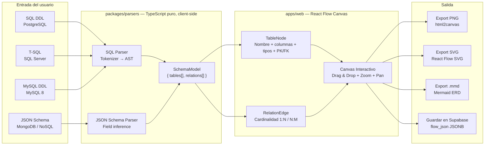
```mermaid
graph LR
    subgraph "Entrada del usuario"
        A["SQL DDL\nPostgreSQL"]
        B["T-SQL\nSQL Server"]
        C["MySQL DDL\nMySQL 8"]
        D["JSON Schema\nMongoDB / NoSQL"]
    end

    subgraph "packages/parsers — TypeScript puro, client-side"
        E["SQL Parser\nTokenizer → AST"]
        F["JSON Schema Parser\nField inference"]
        G["SchemaModel\n{ tables[], relations[] }"]
    end

    subgraph "apps/web — React Flow Canvas"
        H["TableNode\nNombre + columnas + tipos + PK/FK"]
        I["RelationEdge\nCardinalidad 1:N / N:M"]
        J["Canvas Interactivo\nDrag & Drop + Zoom + Pan"]
    end

    subgraph "Salida"
        K["Export PNG\nhtml2canvas"]
        L["Export SVG\nReact Flow SVG"]
        M["Export .mmd\nMermaid ERD"]
        N["Guardar en Supabase\nflow_json JSONB"]
    end

    A --> E
    B --> E
    C --> E
    D --> F
    E --> G
    F --> G
    G --> H
    G --> I
    H --> J
    I --> J
    J --> K
    J --> L
    J --> M
    J --> N
```

**Principios arquitectónicos que justifican este patrón:**

- **Privacidad total:** El schema del usuario nunca sale de su navegador durante el parseo. Supabase solo recibe el `flow_json` serializado cuando el usuario hace clic explícito en "Guardar".
- **Sin backend propio para el core:** Los parsers TypeScript puros eliminan la necesidad de un servidor para la funcionalidad principal de generación de diagramas.
- **Extensibilidad:** Agregar soporte a un nuevo motor SQL = implementar un nuevo parser que retorne `SchemaModel`. No se modifica React Flow, ni la UI, ni la capa de persistencia.
- **Testabilidad:** Cada parser puede testearse de forma completamente aislada con Vitest: entrada DDL conocida → `SchemaModel` esperado, sin ninguna dependencia de browser o servidor.

### 2.2 Estilo Arquitectónico: Monorepo con Packages Compartidos

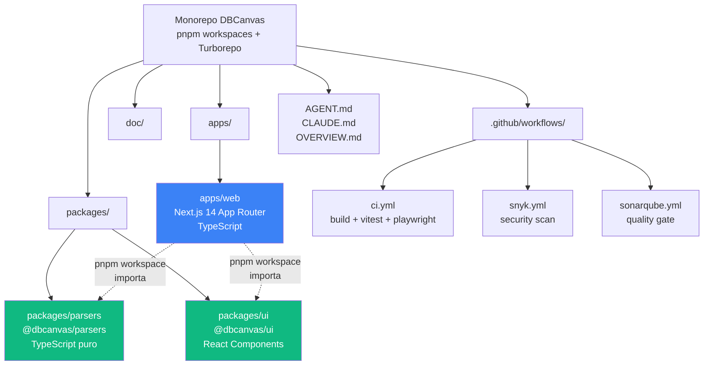
```mermaid
graph TD
    A["Monorepo DBCanvas\npnpm workspaces + Turborepo"] --> B["apps/"]
    A --> C["packages/"]
    A --> D["doc/"]
    A --> E[".github/workflows/"]
    A --> F["AGENT.md\nCLAUDE.md\nOVERVIEW.md"]

    B --> B1["apps/web\nNext.js 14 App Router\nTypeScript"]

    C --> C1["packages/parsers\n@dbcanvas/parsers\nTypeScript puro"]
    C --> C2["packages/ui\n@dbcanvas/ui\nReact Components"]

    B1 -.->|"pnpm workspace\nimporta"| C1
    B1 -.->|"pnpm workspace\nimporta"| C2

    E --> E1["ci.yml\nbuild + vitest + playwright"]
    E --> E2["snyk.yml\nsecurity scan"]
    E --> E3["sonarqube.yml\nquality gate"]

    style B1 fill:#3B82F6,color:#fff
    style C1 fill:#10B981,color:#fff
    style C2 fill:#10B981,color:#fff
```

| Paquete | Responsabilidad | Lenguaje | Dependencias externas |
| :-- | :-- | :-- | :-- |
| `packages/parsers` | Parsers puros: SQL DDL (PG/MySQL/MSSQL) → SchemaModel, JSON Schema → SchemaModel. Sin dependencias de browser ni Node.js. Testeable con Vitest de forma aislada. | TypeScript | Ninguna (zero-dependency) |
| `packages/ui` | Componentes React compartidos: `TableNode`, `RelationEdge`, `DiagramCanvas`, `CodeEditor`, `VersionPanel`, `VersionDiff` | TypeScript / React | React, React Flow, shadcn/ui |
| `apps/web` | Next.js 14 App Router. Integra parsers, React Flow, Supabase Auth/DB/Realtime, API Routes para persistencia y version control. | TypeScript | Next.js, Supabase, Drizzle ORM |

**Turborepo pipeline** (`turbo.json`):

```json
{
  "pipeline": {
    "build": { "dependsOn": ["^build"], "outputs": [".next/**", "dist/**"] },
    "dev":   { "cache": false, "persistent": true },
    "test":  { "dependsOn": ["^build"] },
    "lint":  {}
  }
}
```

Turborepo garantiza que `packages/parsers` y `packages/ui` se compilen antes que `apps/web`, y que los builds sean incrementales (solo recompila lo que cambió).

### 2.3 Estructura interna de apps/web
apps/web/
├── app/ ← Next.js App Router
│ ├── (auth)/
│ │ ├── login/
│ │ │ └── page.tsx ← Formulario de login con Supabase Auth
│ │ └── register/
│ │ └── page.tsx ← Formulario de registro
│ ├── dashboard/
│ │ └── page.tsx ← Grid de proyectos del usuario
│ ├── editor/
│ │ └── [id]/
│ │ └── page.tsx ← Canvas principal + Monaco Editor
│ ├── share/
│ │ └── [token]/
│ │ └── page.tsx ← Vista pública solo lectura
│ ├── api/ ← Next.js API Routes (server-side)
│ │ ├── diagrams/
│ │ │ ├── route.ts ← GET /api/diagrams, POST /api/diagrams
│ │ │ └── [id]/
│ │ │ └── route.ts ← GET/PUT/DELETE /api/diagrams/:id
│ │ ├── projects/
│ │ │ └── route.ts ← GET/POST /api/projects
│ │ ├── versions/
│ │ │ └── route.ts ← POST /api/versions (crear commit)
│ │ ├── collaborators/
│ │ │ └── route.ts ← POST /api/collaborators (invitar)
│ │ └── share/
│ │ └── route.ts ← POST /api/share (generar token)
│ ├── layout.tsx ← Root layout con ThemeProvider
│ └── page.tsx ← Landing page (Kiara)
├── components/
│ ├── canvas/
│ │ ├── DiagramCanvas.tsx ← React Flow wrapper + controls
│ │ ├── TableNode.tsx ← Nodo personalizado: tabla con columnas
│ │ └── RelationEdge.tsx ← Edge personalizado con cardinalidad
│ ├── editor/
│ │ ├── MonacoEditor.tsx ← Monaco con SQL syntax highlighting
│ │ ├── EditorPanel.tsx ← Panel izquierdo: editor + mode selector
│ │ └── DialectSelector.tsx ← Selector PostgreSQL/MySQL/SQL Server/JSON
│ ├── versions/
│ │ ├── VersionPanel.tsx ← Panel historial de commits
│ │ ├── VersionDiff.tsx ← Comparación split-view dos versiones
│ │ └── CommitModal.tsx ← Modal para ingresar mensaje de commit
│ ├── collaboration/
│ │ ├── CollaboratorCursors.tsx ← Cursores en tiempo real de otros usuarios
│ │ └── CollaboratorList.tsx ← Lista de usuarios activos en el editor
│ ├── dashboard/
│ │ ├── ProjectCard.tsx ← Tarjeta de proyecto con preview
│ │ └── NewProjectModal.tsx ← Modal para crear proyecto
│ └── ui/ ← shadcn/ui components
├── lib/
│ ├── db/
│ │ ├── schema.ts ← Drizzle ORM schema (5 tablas)
│ │ ├── client.ts ← Drizzle client con Supabase connection
│ │ └── migrations/ ← Drizzle Kit migrations
│ ├── supabase/
│ │ ├── client.ts ← Supabase browser client
│ │ ├── server.ts ← Supabase server client (SSR/API Routes)
│ │ └── realtime.ts ← Hooks de Realtime: cursores + node sync
│ └── parsers/
│ └── index.ts ← Re-export de @dbcanvas/parsers
├── hooks/
│ ├── useRealtimeCollaboration.ts ← Hook: suscripción Supabase Realtime
│ ├── useDiagramVersions.ts ← Hook: CRUD de versiones
│ └── useParser.ts ← Hook: debounce 300ms → SchemaModel
├── next.config.ts ← output: 'standalone' para Docker
├── tailwind.config.ts
└── package.json


***

## 3. Metas y Restricciones Arquitectónicas

| Meta / Restricción | Categoría | Descripción |
| :-- | :-- | :-- |
| **Parseo client-side** | Privacidad | Los parsers SQL DDL y JSON Schema se ejecutan 100% en el navegador. Ningún schema del usuario se envía al servidor durante el parseo. Cumple con Ley N° 29733 de Protección de Datos del Perú. |
| **Solo lectura** | Seguridad | El sistema nunca modifica la base de datos del usuario. Los parsers trabajan sobre texto DDL, no sobre conexiones live a BDs de producción. |
| **Sin backend propio** | Simplicidad | La Web App usa exclusivamente Next.js API Routes + Supabase. No requiere servidor Go ni proceso separado para la funcionalidad core. |
| **Realtime opt-in** | Rendimiento | La sincronización Supabase Realtime se activa únicamente cuando hay múltiples usuarios con el mismo diagrama abierto. No consume recursos en sesiones individuales. |
| **Sin vendor lock-in** | Portabilidad | Drizzle ORM sobre PostgreSQL estándar permite migrar de Supabase Cloud a cualquier instancia PostgreSQL con un simple `pg_dump`. El schema no usa extensiones propietarias de Supabase. |
| **Extensibilidad de parsers** | Mantenibilidad | Agregar soporte a un nuevo motor SQL = implementar una función `parse(ddl: string): SchemaModel` en `packages/parsers`. No se modifica React Flow ni ninguna capa superior. |
| **Deploy reproducible** | DevOps | Docker Compose garantiza que el entorno de producción en VPS sea byte-idéntico al de desarrollo local. `output: 'standalone'` en Next.js elimina dependencias de Node.js en el contenedor final. |
| **Type safety end-to-end** | Calidad | Drizzle ORM genera tipos TypeScript inferidos del schema. Los parsers exportan interfaces TypeScript estrictas para `SchemaModel`. No existe ningún `any` en las capas críticas del sistema. |

***

## 4. Vista Lógica

### 4.1 Diagrama de Clases — SchemaModel (packages/parsers)

El `SchemaModel` es el contrato central del sistema. Todo parser, sin importar el dialecto SQL o formato JSON, debe producir un objeto que cumpla esta interfaz:

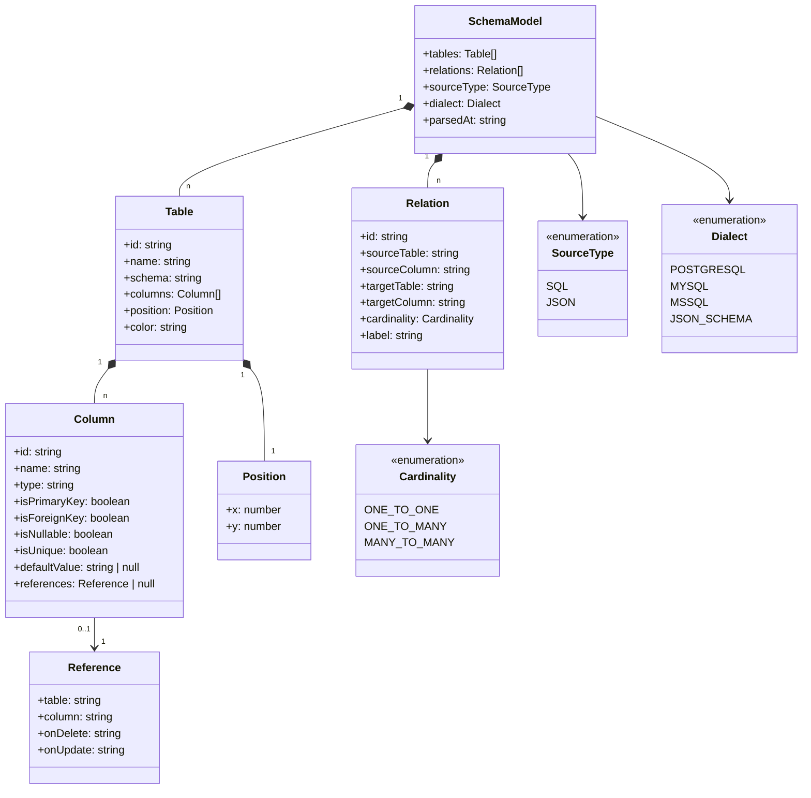
```mermaid
classDiagram
    class SchemaModel {
        +tables: Table[]
        +relations: Relation[]
        +sourceType: SourceType
        +dialect: Dialect
        +parsedAt: string
    }

    class Table {
        +id: string
        +name: string
        +schema: string
        +columns: Column[]
        +position: Position
        +color: string
    }

    class Column {
        +id: string
        +name: string
        +type: string
        +isPrimaryKey: boolean
        +isForeignKey: boolean
        +isNullable: boolean
        +isUnique: boolean
        +defaultValue: string | null
        +references: Reference | null
    }

    class Relation {
        +id: string
        +sourceTable: string
        +sourceColumn: string
        +targetTable: string
        +targetColumn: string
        +cardinality: Cardinality
        +label: string
    }

    class Reference {
        +table: string
        +column: string
        +onDelete: string
        +onUpdate: string
    }

    class Position {
        +x: number
        +y: number
    }

    class SourceType {
        <<enumeration>>
        SQL
        JSON
    }

    class Dialect {
        <<enumeration>>
        POSTGRESQL
        MYSQL
        MSSQL
        JSON_SCHEMA
    }

    class Cardinality {
        <<enumeration>>
        ONE_TO_ONE
        ONE_TO_MANY
        MANY_TO_MANY
    }

    SchemaModel "1" *-- "n" Table
    SchemaModel "1" *-- "n" Relation
    SchemaModel --> SourceType
    SchemaModel --> Dialect
    Table "1" *-- "n" Column
    Table "1" *-- "1" Position
    Column "0..1" --> "1" Reference
    Relation --> Cardinality
```

### 4.2 Diagrama de Clases — Entidades de Dominio (Drizzle Schema)

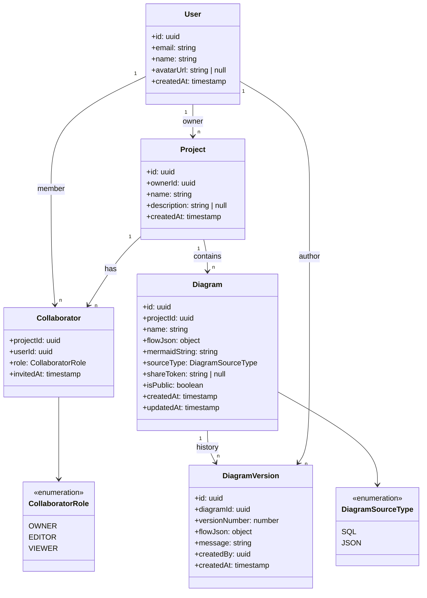
```mermaid
classDiagram
    class User {
        +id: uuid
        +email: string
        +name: string
        +avatarUrl: string | null
        +createdAt: timestamp
    }

    class Project {
        +id: uuid
        +ownerId: uuid
        +name: string
        +description: string | null
        +createdAt: timestamp
    }

    class Collaborator {
        +projectId: uuid
        +userId: uuid
        +role: CollaboratorRole
        +invitedAt: timestamp
    }

    class Diagram {
        +id: uuid
        +projectId: uuid
        +name: string
        +flowJson: object
        +mermaidString: string
        +sourceType: DiagramSourceType
        +shareToken: string | null
        +isPublic: boolean
        +createdAt: timestamp
        +updatedAt: timestamp
    }

    class DiagramVersion {
        +id: uuid
        +diagramId: uuid
        +versionNumber: number
        +flowJson: object
        +message: string
        +createdBy: uuid
        +createdAt: timestamp
    }

    class CollaboratorRole {
        <<enumeration>>
        OWNER
        EDITOR
        VIEWER
    }

    class DiagramSourceType {
        <<enumeration>>
        SQL
        JSON
    }

    User "1" --> "n" Project : owner
    User "1" --> "n" Collaborator : member
    Project "1" --> "n" Collaborator : has
    Project "1" --> "n" Diagram : contains
    Diagram "1" --> "n" DiagramVersion : history
    User "1" --> "n" DiagramVersion : author
    Collaborator --> CollaboratorRole
    Diagram --> DiagramSourceType
```

### 4.3 Diagrama de Clases — Componentes React

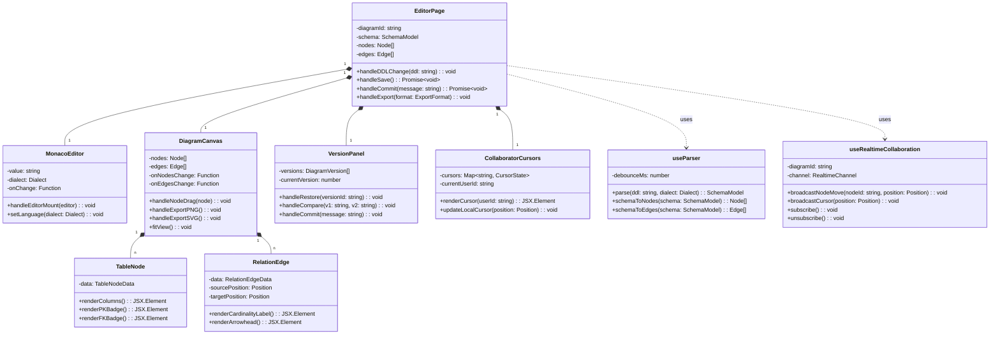
```mermaid
classDiagram
    class EditorPage {
        -diagramId: string
        -schema: SchemaModel
        -nodes: Node[]
        -edges: Edge[]
        +handleDDLChange(ddl: string): void
        +handleSave(): Promise~void~
        +handleCommit(message: string): Promise~void~
        +handleExport(format: ExportFormat): void
    }

    class MonacoEditor {
        -value: string
        -dialect: Dialect
        -onChange: Function
        +handleEditorMount(editor): void
        +setLanguage(dialect: Dialect): void
    }

    class DiagramCanvas {
        -nodes: Node[]
        -edges: Edge[]
        -onNodesChange: Function
        -onEdgesChange: Function
        +handleNodeDrag(node): void
        +handleExportPNG(): void
        +handleExportSVG(): void
        +fitView(): void
    }

    class TableNode {
        -data: TableNodeData
        +renderColumns(): JSX.Element
        +renderPKBadge(): JSX.Element
        +renderFKBadge(): JSX.Element
    }

    class RelationEdge {
        -data: RelationEdgeData
        -sourcePosition: Position
        -targetPosition: Position
        +renderCardinalityLabel(): JSX.Element
        +renderArrowhead(): JSX.Element
    }

    class VersionPanel {
        -versions: DiagramVersion[]
        -currentVersion: number
        +handleRestore(versionId: string): void
        +handleCompare(v1: string, v2: string): void
        +handleCommit(message: string): void
    }

    class CollaboratorCursors {
        -cursors: Map~string, CursorState~
        -currentUserId: string
        +renderCursor(userId: string): JSX.Element
        +updateLocalCursor(position: Position): void
    }

    class useParser {
        -debounceMs: number
        +parse(ddl: string, dialect: Dialect): SchemaModel
        +schemaToNodes(schema: SchemaModel): Node[]
        +schemaToEdges(schema: SchemaModel): Edge[]
    }

    class useRealtimeCollaboration {
        -diagramId: string
        -channel: RealtimeChannel
        +broadcastNodeMove(nodeId: string, position: Position): void
        +broadcastCursor(position: Position): void
        +subscribe(): void
        +unsubscribe(): void
    }

    EditorPage "1" *-- "1" MonacoEditor
    EditorPage "1" *-- "1" DiagramCanvas
    EditorPage "1" *-- "1" VersionPanel
    EditorPage "1" *-- "1" CollaboratorCursors
    EditorPage ..> useParser : uses
    EditorPage ..> useRealtimeCollaboration : uses
    DiagramCanvas "1" *-- "n" TableNode
    DiagramCanvas "1" *-- "n" RelationEdge
```

### 4.4 Diagrama de Base de Datos

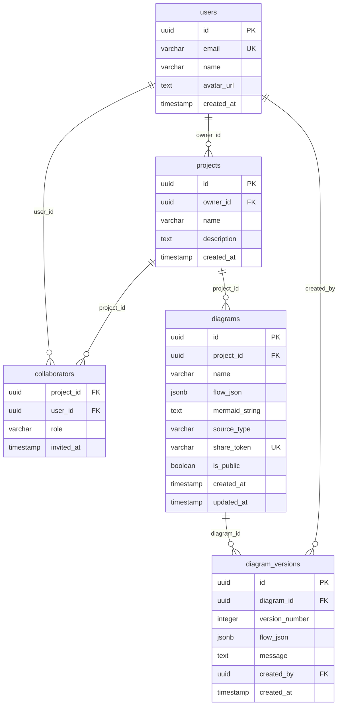
```mermaid
erDiagram
    users {
        uuid id PK
        varchar email UK
        varchar name
        text avatar_url
        timestamp created_at
    }

    projects {
        uuid id PK
        uuid owner_id FK
        varchar name
        text description
        timestamp created_at
    }

    collaborators {
        uuid project_id FK
        uuid user_id FK
        varchar role
        timestamp invited_at
    }

    diagrams {
        uuid id PK
        uuid project_id FK
        varchar name
        jsonb flow_json
        text mermaid_string
        varchar source_type
        varchar share_token UK
        boolean is_public
        timestamp created_at
        timestamp updated_at
    }

    diagram_versions {
        uuid id PK
        uuid diagram_id FK
        integer version_number
        jsonb flow_json
        text message
        uuid created_by FK
        timestamp created_at
    }

    users ||--o{ projects : "owner_id"
    users ||--o{ collaborators : "user_id"
    projects ||--o{ collaborators : "project_id"
    projects ||--o{ diagrams : "project_id"
    diagrams ||--o{ diagram_versions : "diagram_id"
    users ||--o{ diagram_versions : "created_by"
```

### 4.5 Diagrama de Componentes del Monorepo

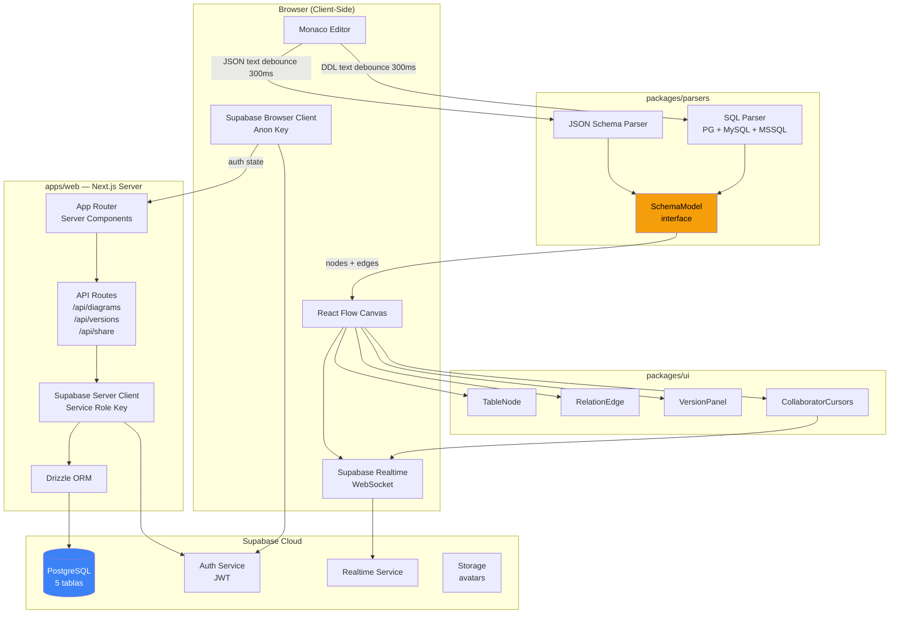
```mermaid
graph TB
    subgraph "Browser (Client-Side)"
        MC[Monaco Editor]
        RF[React Flow Canvas]
        SBC[Supabase Browser Client\nAnon Key]
        RT[Supabase Realtime\nWebSocket]
    end

    subgraph "apps/web — Next.js Server"
        SSR[App Router\nServer Components]
        API[API Routes\n/api/diagrams\n/api/versions\n/api/share]
        SBS[Supabase Server Client\nService Role Key]
        DZ[Drizzle ORM]
    end

    subgraph "packages/parsers"
        SP[SQL Parser\nPG + MySQL + MSSQL]
        JP[JSON Schema Parser]
        SM[SchemaModel\ninterface]
    end

    subgraph "packages/ui"
        TN[TableNode]
        RE[RelationEdge]
        VP[VersionPanel]
        CC[CollaboratorCursors]
    end

    subgraph "Supabase Cloud"
        PG[(PostgreSQL\n5 tablas)]
        AUTH[Auth Service\nJWT]
        RTS[Realtime Service]
        STG[Storage\navatars]
    end

    MC -->|DDL text debounce 300ms| SP
    MC -->|JSON text debounce 300ms| JP
    SP --> SM
    JP --> SM
    SM -->|nodes + edges| RF
    RF --> TN
    RF --> RE
    RF --> VP
    RF --> CC

    SBC -->|auth state| SSR
    SBC --> AUTH
    RT --> RTS
    CC --> RT
    RF --> RT

    SSR --> API
    API --> SBS
    SBS --> DZ
    DZ --> PG
    SBS --> AUTH

    style SM fill:#F59E0B,color:#000
    style PG fill:#3B82F6,color:#fff
```

### 4.6 Secuencia — Parseo y Render en Tiempo Real

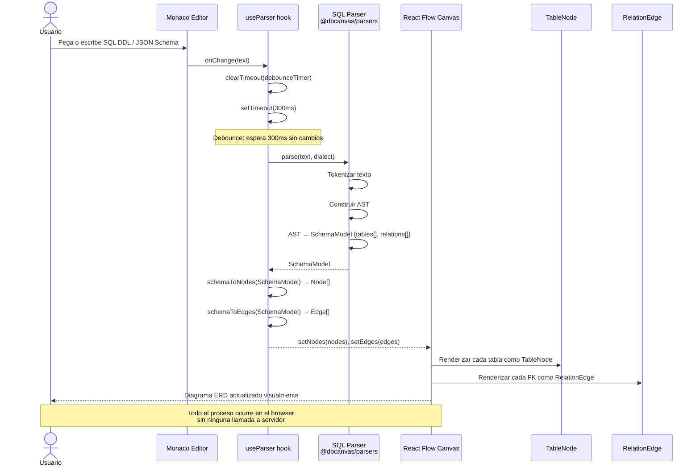
```mermaid
sequenceDiagram
    actor U as Usuario
    participant MC as Monaco Editor
    participant HP as useParser hook
    participant SP as SQL Parser<br/>@dbcanvas/parsers
    participant RF as React Flow Canvas
    participant TN as TableNode
    participant RE as RelationEdge

    U->>MC: Pega o escribe SQL DDL / JSON Schema
    MC->>HP: onChange(text)
    HP->>HP: clearTimeout(debounceTimer)
    HP->>HP: setTimeout(300ms)
    Note over HP: Debounce: espera 300ms sin cambios

    HP->>SP: parse(text, dialect)
    SP->>SP: Tokenizar texto
    SP->>SP: Construir AST
    SP->>SP: AST → SchemaModel {tables[], relations[]}
    SP-->>HP: SchemaModel

    HP->>HP: schemaToNodes(SchemaModel) → Node[]
    HP->>HP: schemaToEdges(SchemaModel) → Edge[]
    HP-->>RF: setNodes(nodes), setEdges(edges)

    RF->>TN: Renderizar cada tabla como TableNode
    RF->>RE: Renderizar cada FK como RelationEdge
    RF-->>U: Diagrama ERD actualizado visualmente

    Note over U,RF: Todo el proceso ocurre en el browser<br/>sin ninguna llamada a servidor
```

### 4.7 Secuencia — Autenticación con Supabase

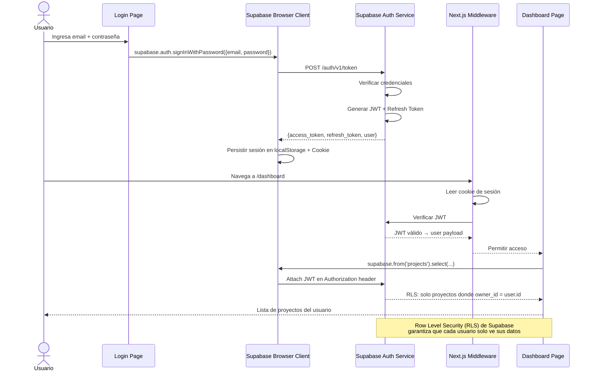
```mermaid
sequenceDiagram
    actor U as Usuario
    participant LP as Login Page
    participant SBC as Supabase Browser Client
    participant SA as Supabase Auth Service
    participant MW as Next.js Middleware
    participant DB as Dashboard Page

    U->>LP: Ingresa email + contraseña
    LP->>SBC: supabase.auth.signInWithPassword({email, password})
    SBC->>SA: POST /auth/v1/token
    SA->>SA: Verificar credenciales
    SA->>SA: Generar JWT + Refresh Token
    SA-->>SBC: {access_token, refresh_token, user}
    SBC->>SBC: Persistir sesión en localStorage + Cookie

    U->>MW: Navega a /dashboard
    MW->>MW: Leer cookie de sesión
    MW->>SA: Verificar JWT
    SA-->>MW: JWT válido → user payload
    MW-->>DB: Permitir acceso

    DB->>SBC: supabase.from('projects').select(...)
    SBC->>SA: Attach JWT en Authorization header
    SA-->>DB: RLS: solo proyectos donde owner_id = user.id
    DB-->>U: Lista de proyectos del usuario

    Note over SA,DB: Row Level Security (RLS) de Supabase<br/>garantiza que cada usuario solo ve sus datos
```

### 4.8 Secuencia — Colaboración en Tiempo Real

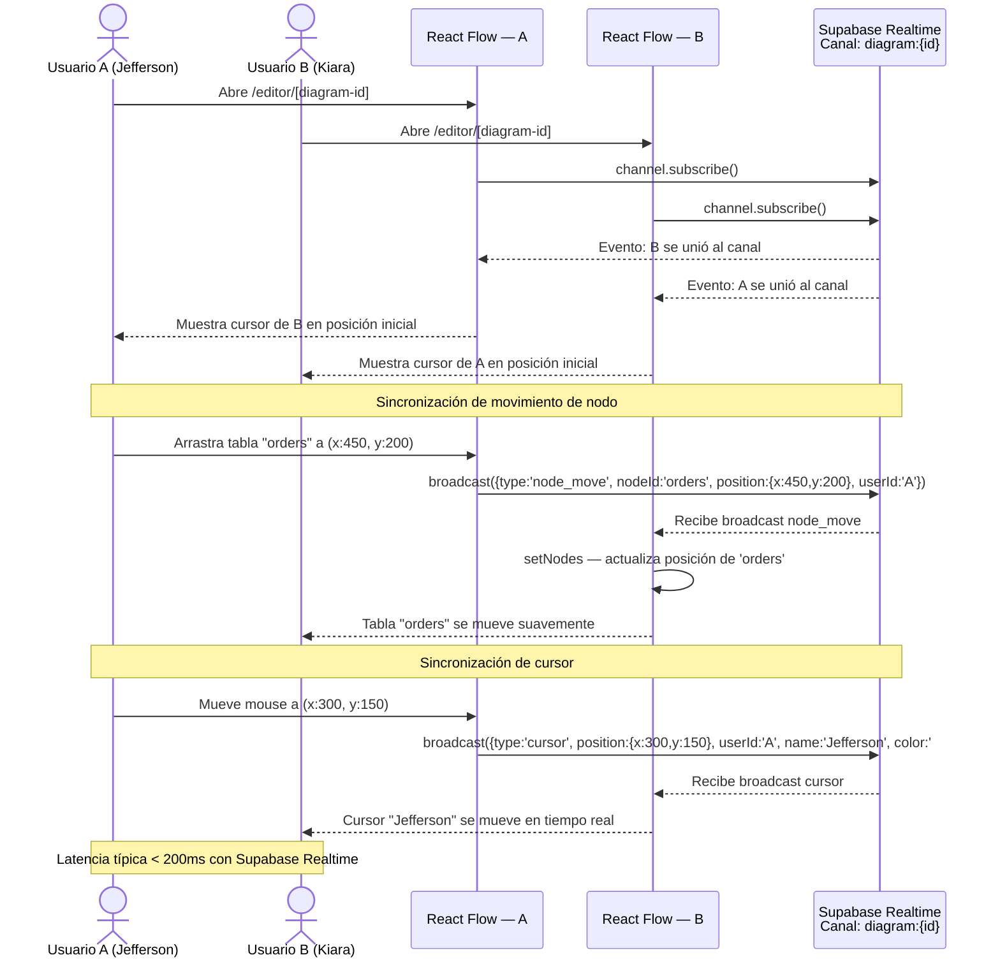
```mermaid
sequenceDiagram
    actor A as Usuario A (Jefferson)
    actor B as Usuario B (Kiara)
    participant RFA as React Flow — A
    participant RFB as React Flow — B
    participant RT as Supabase Realtime<br/>Canal: diagram:{id}

    A->>RFA: Abre /editor/[diagram-id]
    B->>RFB: Abre /editor/[diagram-id]

    RFA->>RT: channel.subscribe()
    RFB->>RT: channel.subscribe()
    RT-->>RFA: Evento: B se unió al canal
    RT-->>RFB: Evento: A se unió al canal

    RFA-->>A: Muestra cursor de B en posición inicial
    RFB-->>B: Muestra cursor de A en posición inicial

    Note over A,RT: Sincronización de movimiento de nodo

    A->>RFA: Arrastra tabla "orders" a (x:450, y:200)
    RFA->>RT: broadcast({type:'node_move', nodeId:'orders', position:{x:450,y:200}, userId:'A'})
    RT-->>RFB: Recibe broadcast node_move
    RFB->>RFB: setNodes — actualiza posición de 'orders'
    RFB-->>B: Tabla "orders" se mueve suavemente

    Note over A,RT: Sincronización de cursor

    A->>RFA: Mueve mouse a (x:300, y:150)
    RFA->>RT: broadcast({type:'cursor', position:{x:300,y:150}, userId:'A', name:'Jefferson', color:'#3B82F6'})
    RT-->>RFB: Recibe broadcast cursor
    RFB-->>B: Cursor "Jefferson" se mueve en tiempo real

    Note over A,B: Latencia típica < 200ms con Supabase Realtime
```

### 4.9 Secuencia — Version Control (Commit y Restaurar)

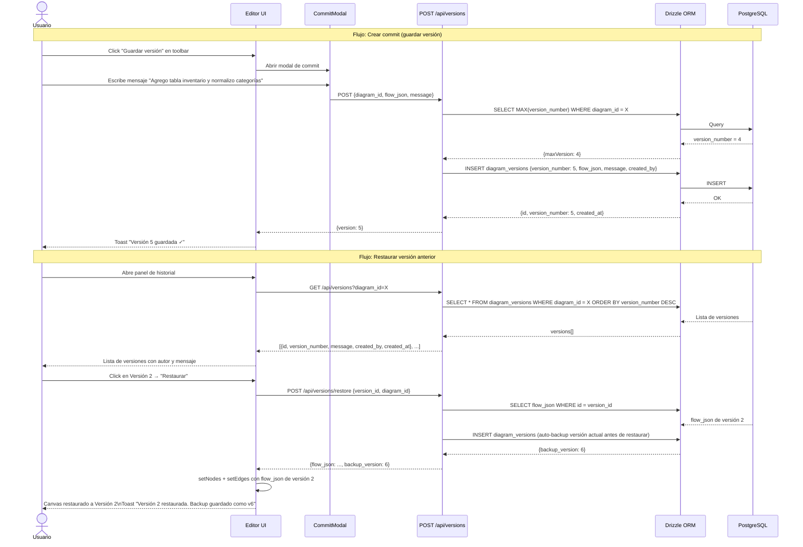
```mermaid
sequenceDiagram
    actor U as Usuario
    participant UI as Editor UI
    participant CM as CommitModal
    participant API as POST /api/versions
    participant DZ as Drizzle ORM
    participant PG as PostgreSQL

    Note over U,PG: Flujo: Crear commit (guardar versión)

    U->>UI: Click "Guardar versión" en toolbar
    UI->>CM: Abrir modal de commit
    U->>CM: Escribe mensaje "Agrego tabla inventario y normalizo categorías"
    CM->>API: POST {diagram_id, flow_json, message}
    API->>DZ: SELECT MAX(version_number) WHERE diagram_id = X
    DZ->>PG: Query
    PG-->>DZ: version_number = 4
    DZ-->>API: {maxVersion: 4}
    API->>DZ: INSERT diagram_versions {version_number: 5, flow_json, message, created_by}
    DZ->>PG: INSERT
    PG-->>DZ: OK
    DZ-->>API: {id, version_number: 5, created_at}
    API-->>UI: {version: 5}
    UI-->>U: Toast "Versión 5 guardada ✓"

    Note over U,PG: Flujo: Restaurar versión anterior

    U->>UI: Abre panel de historial
    UI->>API: GET /api/versions?diagram_id=X
    API->>DZ: SELECT * FROM diagram_versions WHERE diagram_id = X ORDER BY version_number DESC
    PG-->>DZ: Lista de versiones
    DZ-->>API: versions[]
    API-->>UI: [{id, version_number, message, created_by, created_at}, ...]
    UI-->>U: Lista de versiones con autor y mensaje

    U->>UI: Click en Versión 2 → "Restaurar"
    UI->>API: POST /api/versions/restore {version_id, diagram_id}
    API->>DZ: SELECT flow_json WHERE id = version_id
    PG-->>DZ: flow_json de versión 2
    API->>DZ: INSERT diagram_versions (auto-backup versión actual antes de restaurar)
    DZ-->>API: {backup_version: 6}
    API-->>UI: {flow_json: ..., backup_version: 6}
    UI->>UI: setNodes + setEdges con flow_json de versión 2
    UI-->>U: Canvas restaurado a Versión 2\nToast "Versión 2 restaurada. Backup guardado como v6"
```

### 4.10 Secuencia — Export de Diagrama

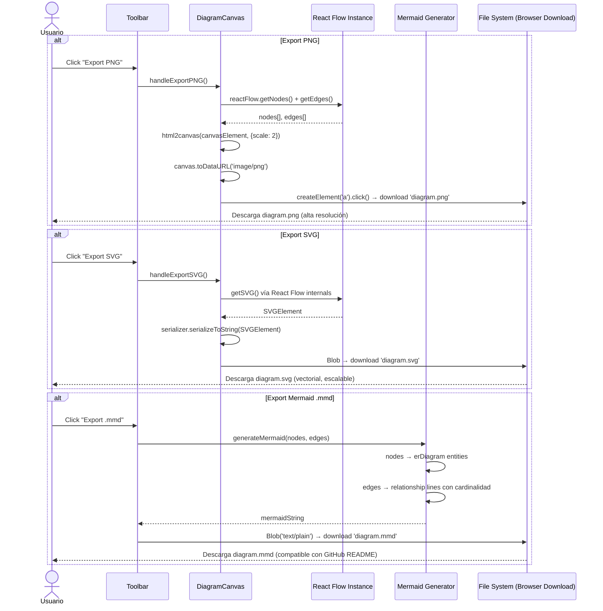
```mermaid
sequenceDiagram
    actor U as Usuario
    participant TB as Toolbar
    participant DC as DiagramCanvas
    participant RF as React Flow Instance
    participant MM as Mermaid Generator
    participant FS as File System (Browser Download)

    alt Export PNG
        U->>TB: Click "Export PNG"
        TB->>DC: handleExportPNG()
        DC->>RF: reactFlow.getNodes() + getEdges()
        RF-->>DC: nodes[], edges[]
        DC->>DC: html2canvas(canvasElement, {scale: 2})
        DC->>DC: canvas.toDataURL('image/png')
        DC->>FS: createElement('a').click() → download 'diagram.png'
        FS-->>U: Descarga diagram.png (alta resolución)
    end

    alt Export SVG
        U->>TB: Click "Export SVG"
        TB->>DC: handleExportSVG()
        DC->>RF: getSVG() vía React Flow internals
        RF-->>DC: SVGElement
        DC->>DC: serializer.serializeToString(SVGElement)
        DC->>FS: Blob → download 'diagram.svg'
        FS-->>U: Descarga diagram.svg (vectorial, escalable)
    end

    alt Export Mermaid .mmd
        U->>TB: Click "Export .mmd"
        TB->>MM: generateMermaid(nodes, edges)
        MM->>MM: nodes → erDiagram entities
        MM->>MM: edges → relationship lines con cardinalidad
        MM-->>TB: mermaidString
        TB->>FS: Blob('text/plain') → download 'diagram.mmd'
        FS-->>U: Descarga diagram.mmd (compatible con GitHub README)
    end
```

***

## 5. Vista de Procesos

### 5.1 Cobertura de Tipos de Base de Datos

| Categoría | Motor | Mecanismo de entrada | Nodos generados | Edges generados |
| :-- | :-- | :-- | :-- | :-- |
| **Relacional** | PostgreSQL 14+ | Parser SQL DDL — `CREATE TABLE`, `PRIMARY KEY`, `FOREIGN KEY`, `SERIAL`, `UUID` | Tabla con columnas, tipos nativos PG, badges PK/FK | FK con cardinalidad inferida de constraints |
| **Relacional** | SQL Server / T-SQL | Parser T-SQL — `IDENTITY`, `NVARCHAR`, `UNIQUEIDENTIFIER`, `CONSTRAINT` | Tabla con tipos MSSQL, soporte de schemas (`dbo.`) | FK con `REFERENCES` + `ON DELETE` |
| **Relacional** | MySQL 8 / MariaDB | Parser MySQL DDL — `AUTO_INCREMENT`, `ENGINE`, `ENUM`, `TINYINT(1)` | Tabla con tipos MySQL, soporte `UNSIGNED` | FK con `ON DELETE CASCADE` |
| **Documental / NoSQL** | MongoDB, CouchDB | Parser JSON Schema — campos, tipos, `$ref`, arrays de objetos | Colección como tabla, campos como columnas, tipos inferidos | Relaciones por `$ref` como edges |
| **Key-Value** | Redis, DynamoDB | Parser JSON Schema (definición manual de estructura) | Store como tabla, key/value como columnas | Sin edges (estructura plana) |

### 5.2 Pipeline de Parseo SQL Multi-Dialecto

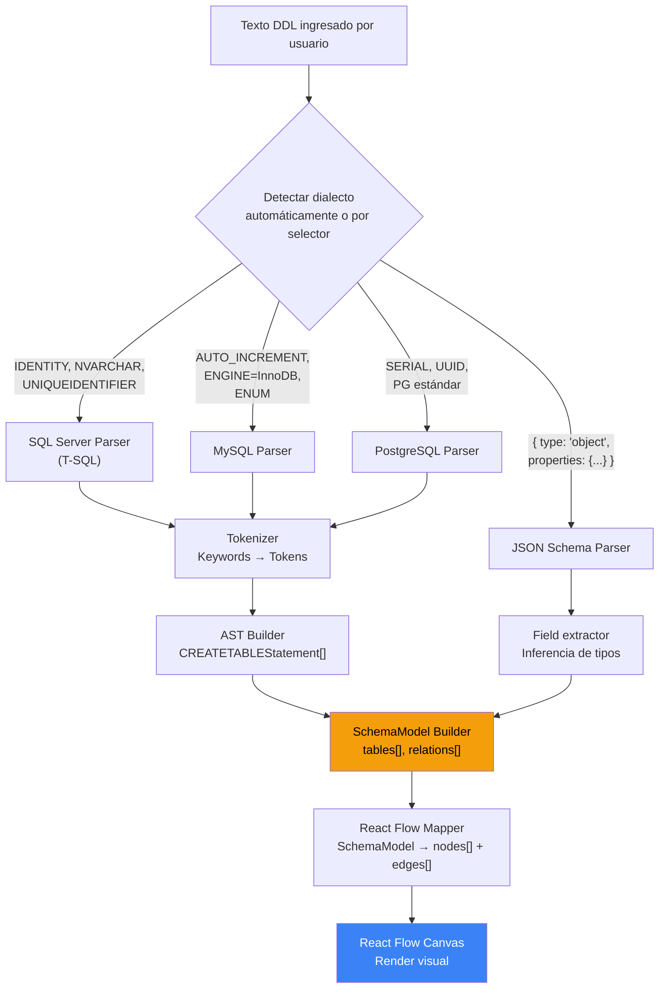
```mermaid
graph TD
    A["Texto DDL ingresado por usuario"] --> B{"Detectar dialecto\nautomáticamente o por selector"}

    B -->|"IDENTITY, NVARCHAR,\nUNIQUEIDENTIFIER"| C["SQL Server Parser\n(T-SQL)"]
    B -->|"AUTO_INCREMENT,\nENGINE=InnoDB,\nENUM"| D["MySQL Parser"]
    B -->|"SERIAL, UUID,\nPG estándar"| E["PostgreSQL Parser"]
    B -->|"{ type: 'object',\nproperties: {...} }"| F["JSON Schema Parser"]

    C --> G["Tokenizer\nKeywords → Tokens"]
    D --> G
    E --> G
    F --> H["Field extractor\nInferencia de tipos"]

    G --> I["AST Builder\nCREATETABLEStatement[]"]
    I --> J["SchemaModel Builder\ntables[], relations[]"]
    H --> J

    J --> K["React Flow Mapper\nSchemaModel → nodes[] + edges[]"]
    K --> L["React Flow Canvas\nRender visual"]

    style J fill:#F59E0B,color:#000
    style L fill:#3B82F6,color:#fff
```

### 5.3 Ciclo de Vida de un Diagrama

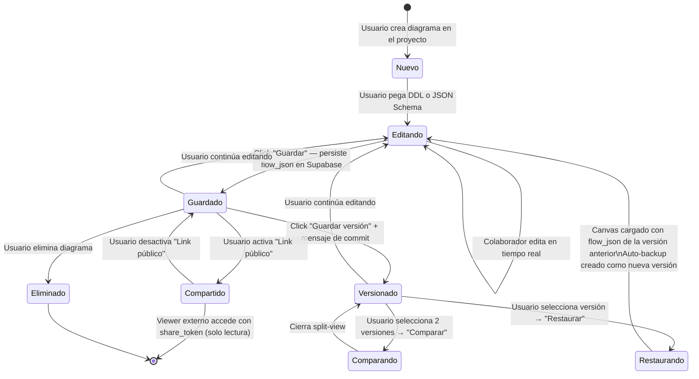
```mermaid
stateDiagram-v2
    [*] --> Nuevo : Usuario crea diagrama en el proyecto

    Nuevo --> Editando : Usuario pega DDL o JSON Schema

    Editando --> Editando : Modifica SQL (debounce 300ms re-parsea)
    Editando --> Editando : Arrastra tablas en el canvas
    Editando --> Editando : Colaborador edita en tiempo real

    Editando --> Guardado : Click "Guardar" — persiste flow_json en Supabase
    Guardado --> Editando : Usuario continúa editando

    Guardado --> Versionado : Click "Guardar versión" + mensaje de commit
    Versionado --> Editando : Usuario continúa editando

    Versionado --> Comparando : Usuario selecciona 2 versiones → "Comparar"
    Comparando --> Versionado : Cierra split-view

    Versionado --> Restaurando : Usuario selecciona versión → "Restaurar"
    Restaurando --> Editando : Canvas cargado con flow_json de la versión anterior\nAuto-backup creado como nueva versión

    Guardado --> Compartido : Usuario activa "Link público"
    Compartido --> Guardado : Usuario desactiva "Link público"
    Compartido --> [*] : Viewer externo accede con share_token (solo lectura)

    Guardado --> Eliminado : Usuario elimina diagrama
    Eliminado --> [*]
```

### 5.4 Flujo de Autenticación y Sesión

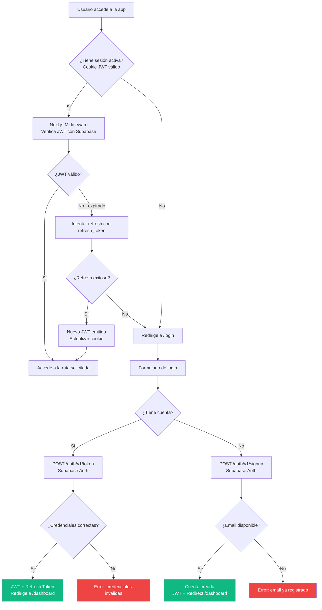
```mermaid
flowchart TD
    A[Usuario accede a la app] --> B{¿Tiene sesión activa?\nCookie JWT válido}

    B -->|Sí| C[Next.js Middleware\nVerifica JWT con Supabase]
    B -->|No| D[Redirige a /login]

    C --> E{¿JWT válido?}
    E -->|Sí| F[Accede a la ruta solicitada]
    E -->|No - expirado| G[Intentar refresh con refresh_token]

    G --> H{¿Refresh exitoso?}
    H -->|Sí| I[Nuevo JWT emitido\nActualizar cookie]
    H -->|No| D

    I --> F

    D --> J[Formulario de login]
    J --> K{¿Tiene cuenta?}
    K -->|Sí| L[POST /auth/v1/token\nSupabase Auth]
    K -->|No| M[POST /auth/v1/signup\nSupabase Auth]

    L --> N{¿Credenciales correctas?}
    N -->|Sí| O[JWT + Refresh Token\nRedirige a /dashboard]
    N -->|No| P[Error: credenciales inválidas]

    M --> Q{¿Email disponible?}
    Q -->|Sí| R[Cuenta creada\nJWT + Redirect /dashboard]
    Q -->|No| S[Error: email ya registrado]

    style O fill:#10B981,color:#fff
    style R fill:#10B981,color:#fff
    style P fill:#EF4444,color:#fff
    style S fill:#EF4444,color:#fff
```

***

## 6. Vista de Despliegue

### 6.1 Opción A — VPS con Docker + Nginx (Producción)

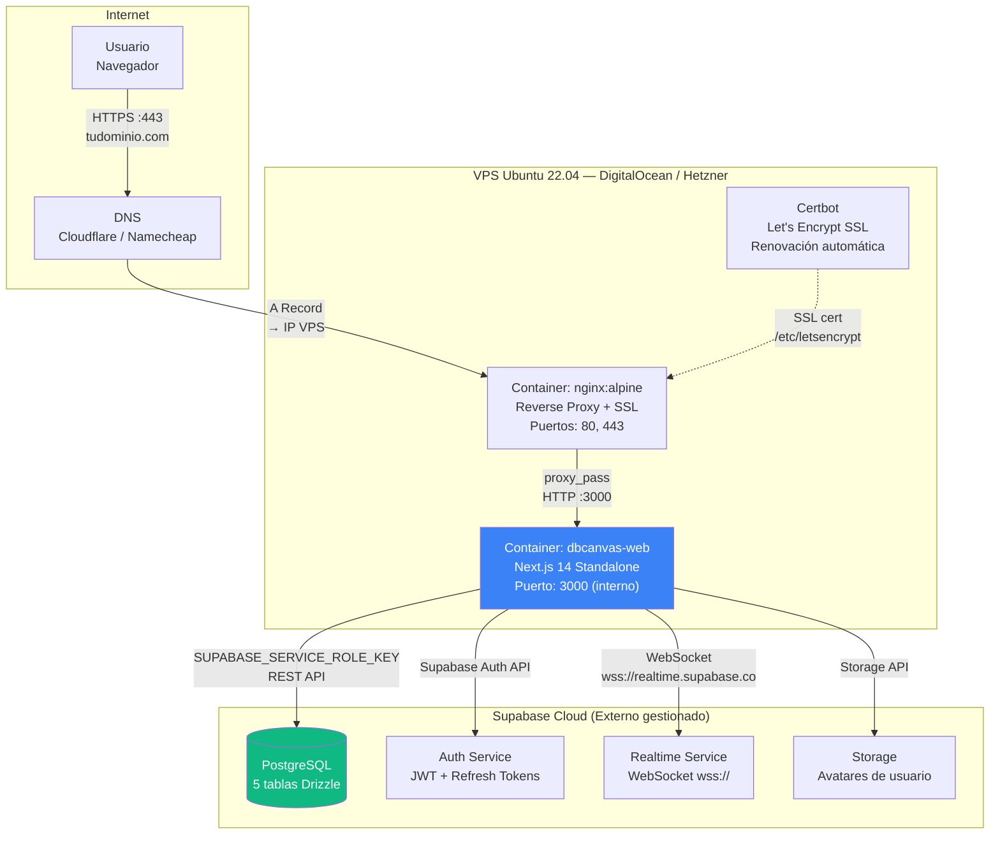
```mermaid
graph TB
    subgraph "Internet"
        U["Usuario\nNavegador"]
        DNS["DNS\nCloudflare / Namecheap"]
    end

    subgraph "VPS Ubuntu 22.04 — DigitalOcean / Hetzner"
        direction TB
        NX["Container: nginx:alpine\nReverse Proxy + SSL\nPuertos: 80, 443"]
        WEB["Container: dbcanvas-web\nNext.js 14 Standalone\nPuerto: 3000 (interno)"]
        CERT["Certbot\nLet's Encrypt SSL\nRenovación automática"]
    end

    subgraph "Supabase Cloud (Externo gestionado)"
        SBPG[("PostgreSQL\n5 tablas Drizzle")]
        SBAUTH["Auth Service\nJWT + Refresh Tokens"]
        SBRT["Realtime Service\nWebSocket wss://"]
        SBSTG["Storage\nAvatares de usuario"]
    end

    U -->|"HTTPS :443\ntudominio.com"| DNS
    DNS -->|"A Record\n→ IP VPS"| NX
    NX -->|"proxy_pass\nHTTP :3000"| WEB
    CERT -.->|"SSL cert\n/etc/letsencrypt"| NX

    WEB -->|"SUPABASE_SERVICE_ROLE_KEY\nREST API"| SBPG
    WEB -->|"Supabase Auth API"| SBAUTH
    WEB -->|"WebSocket\nwss://realtime.supabase.co"| SBRT
    WEB -->|"Storage API"| SBSTG

    style WEB fill:#3B82F6,color:#fff
    style SBPG fill:#10B981,color:#fff
```

**Contenedores Docker Compose:**

```yaml
version: '3.9'
services:
  web:
    build:
      context: .
      dockerfile: apps/web/Dockerfile
    container_name: dbcanvas-web
    restart: unless-stopped
    env_file: .env.production
    ports:
      - "3000:3000"
    networks:
      - dbcanvas-net

  nginx:
    image: nginx:alpine
    container_name: dbcanvas-nginx
    restart: unless-stopped
    ports:
      - "80:80"
      - "443:443"
    volumes:
      - ./nginx/nginx.conf:/etc/nginx/nginx.conf:ro
      - ./certbot/conf:/etc/letsencrypt:ro
      - ./certbot/www:/var/www/certbot:ro
    depends_on:
      - web
    networks:
      - dbcanvas-net

networks:
  dbcanvas-net:
    driver: bridge
```

**Dockerfile (Next.js standalone):**

```dockerfile
FROM node:20-alpine AS base
RUN npm install -g pnpm

FROM base AS deps
WORKDIR /app
COPY package.json pnpm-workspace.yaml turbo.json ./
COPY apps/web/package.json ./apps/web/
COPY packages/parsers/package.json ./packages/parsers/
COPY packages/ui/package.json ./packages/ui/
RUN pnpm install --frozen-lockfile

FROM base AS builder
WORKDIR /app
COPY --from=deps /app/node_modules ./node_modules
COPY . .
RUN pnpm --filter @dbcanvas/web build

FROM node:20-alpine AS runner
WORKDIR /app
ENV NODE_ENV=production
COPY --from=builder /app/apps/web/.next/standalone ./
COPY --from=builder /app/apps/web/.next/static ./apps/web/.next/static
COPY --from=builder /app/apps/web/public ./apps/web/public
EXPOSE 3000
CMD ["node", "apps/web/server.js"]
```

### 6.2 Opción B — Vercel (Deploy académico simplificado)

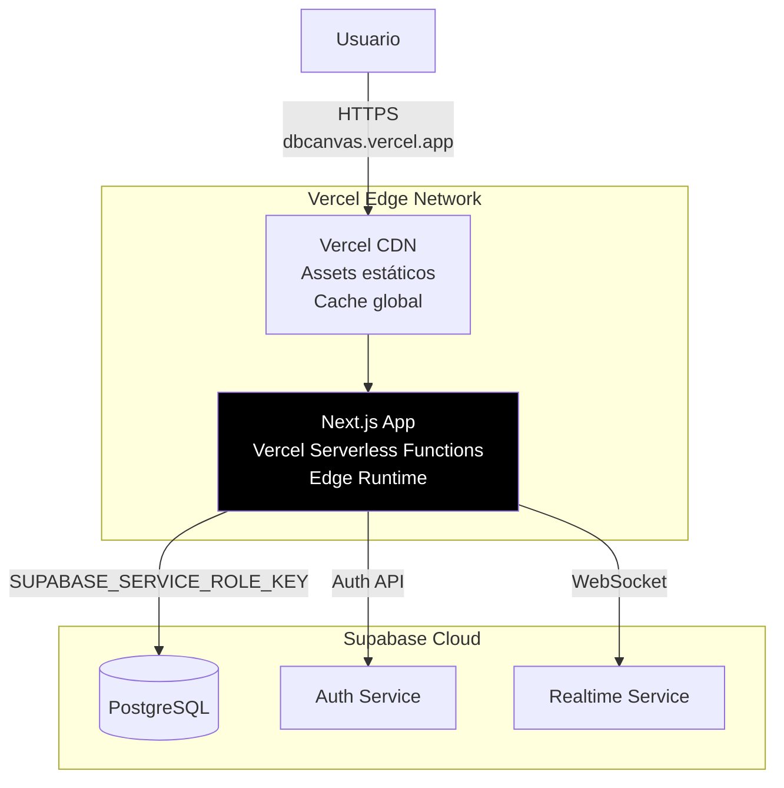
```mermaid
graph TB
    subgraph "Vercel Edge Network"
        V["Next.js App\nVercel Serverless Functions\nEdge Runtime"]
        CDN["Vercel CDN\nAssets estáticos\nCache global"]
    end

    subgraph "Supabase Cloud"
        SBPG2[("PostgreSQL")]
        SBAUTH2["Auth Service"]
        SBRT2["Realtime Service"]
    end

    U2["Usuario"] -->|"HTTPS\ndbcanvas.vercel.app"| CDN
    CDN --> V
    V -->|"SUPABASE_SERVICE_ROLE_KEY"| SBPG2
    V -->|"Auth API"| SBAUTH2
    V -->|"WebSocket"| SBRT2

    style V fill:#000,color:#fff
```

**Comando de deploy:**
```bash
# Desde la raíz del monorepo
vercel --prod
# Vercel detecta automáticamente el Next.js en apps/web
# vía vercel.json con { "buildCommand": "pnpm --filter @dbcanvas/web build" }
```

### 6.3 Variables de Entorno Requeridas

| Variable | Descripción | Dónde se usa | Expuesta al cliente |
| :-- | :-- | :-- | :-- |
| `NEXT_PUBLIC_SUPABASE_URL` | URL pública del proyecto Supabase | Browser + Server | ✅ Sí (`NEXT_PUBLIC_`) |
| `NEXT_PUBLIC_SUPABASE_ANON_KEY` | Anon key de Supabase (segura para exponer) | Browser + Server | ✅ Sí (`NEXT_PUBLIC_`) |
| `SUPABASE_SERVICE_ROLE_KEY` | Service role key — acceso sin RLS | Solo API Routes (server) | ❌ No |
| `DATABASE_URL` | Connection string PostgreSQL para Drizzle migrations | Solo build/migraciones | ❌ No |
| `NEXTAUTH_SECRET` | Secret para firmar cookies de sesión | Solo server | ❌ No |
| `NEXTAUTH_URL` | URL pública del deploy (ej: `https://dbcanvas.vercel.app`) | Solo server | ❌ No |

***

## 7. Vista de Infraestructura

### 7.1 Diagrama de Infraestructura Completo

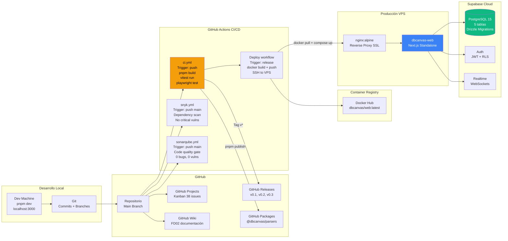
```mermaid
graph LR
    subgraph "Desarrollo Local"
        DEV["Dev Machine\npnpm dev\nlocalhost:3000"]
        GIT["Git\nCommits + Branches"]
    end

    subgraph "GitHub"
        REPO["Repositorio\nMain Branch"]
        GHP["GitHub Projects\nKanban 38 issues"]
        GHW["GitHub Wiki\nFD02 documentación"]
        GHRP["GitHub Releases\nv0.1, v0.2, v0.3"]
        GHPKG["GitHub Packages\n@dbcanvas/parsers"]
    end

    subgraph "GitHub Actions CI/CD"
        CI["ci.yml\nTrigger: push\npnpm build\nvitest run\nplaywright test"]
        SNYK["snyk.yml\nTrigger: push main\nDependency scan\nNo critical vulns"]
        SQ["sonarqube.yml\nTrigger: push main\nCode quality gate\n0 bugs, 0 vulns"]
        DEPLOY["Deploy workflow\nTrigger: release\ndocker build + push\nSSH to VPS"]
    end

    subgraph "Container Registry"
        DKRHUB["Docker Hub\ndbcanvas/web:latest"]
    end

    subgraph "Producción VPS"
        NGINX["nginx:alpine\nReverse Proxy SSL"]
        NEXT["dbcanvas-web\nNext.js Standalone"]
    end

    subgraph "Supabase Cloud"
        SB_PG[("PostgreSQL 15\n5 tablas\nDrizzle Migrations")]
        SB_AUTH["Auth\nJWT + RLS"]
        SB_RT["Realtime\nWebSockets"]
    end

    DEV --> GIT
    GIT --> REPO
    REPO --> GHP
    REPO --> GHW
    REPO --> CI
    REPO --> SNYK
    REPO --> SQ
    CI -->|"Tag v*"| GHRP
    CI -->|"pnpm publish"| GHPKG
    CI --> DEPLOY
    DEPLOY --> DKRHUB
    DEPLOY -->|"docker pull + compose up"| NGINX
    NGINX --> NEXT
    NEXT --> SB_PG
    NEXT --> SB_AUTH
    NEXT --> SB_RT

    style NEXT fill:#3B82F6,color:#fff
    style SB_PG fill:#10B981,color:#fff
    style CI fill:#F59E0B,color:#000
```

### 7.2 GitHub Actions — Workflows Detallados

**ci.yml — Integración Continua:**

```yaml
name: CI
on:
  push:
    branches: ['*']
  pull_request:
    branches: [main]

jobs:
  build-and-test:
    runs-on: ubuntu-latest
    steps:
      - uses: actions/checkout@v4
      - uses: pnpm/action-setup@v3
        with: { version: 8 }
      - uses: actions/setup-node@v4
        with: { node-version: '20', cache: 'pnpm' }
      - run: pnpm install --frozen-lockfile
      - run: pnpm build                          # Turborepo build todos los packages
      - run: pnpm --filter @dbcanvas/parsers test # Vitest unitarios
      - run: pnpm --filter @dbcanvas/web test:e2e # Playwright E2E
```

**snyk.yml — Análisis de Seguridad:**

```yaml
name: Snyk Security
on:
  push:
    branches: [main]
  pull_request:

jobs:
  security:
    runs-on: ubuntu-latest
    steps:
      - uses: actions/checkout@v4
      - uses: snyk/actions/node@master
        env:
          SNYK_TOKEN: ${{ secrets.SNYK_TOKEN }}
        with:
          args: --severity-threshold=high --all-projects
```

**sonarqube.yml — Quality Gate:**

```yaml
name: SonarQube
on:
  push:
    branches: [main]

jobs:
  sonarqube:
    runs-on: ubuntu-latest
    steps:
      - uses: actions/checkout@v4
        with: { fetch-depth: 0 }
      - uses: SonarSource/sonarqube-scan-action@master
        env:
          SONAR_TOKEN: ${{ secrets.SONAR_TOKEN }}
          SONAR_HOST_URL: ${{ secrets.SONAR_HOST_URL }}
        with:
          args: >
            -Dsonar.projectKey=dbcanvas
            -Dsonar.sources=apps/web/app,apps/web/components,packages
            -Dsonar.exclusions=**/node_modules/**,**/.next/**
```

| Workflow | Trigger | Criterio de éxito |
| :-- | :-- | :-- |
| `ci.yml` | Push a cualquier rama | Build exitoso + Vitest ≥80% cobertura + Playwright sin fallos |
| `snyk.yml` | Push a `main` / PRs | 0 vulnerabilidades de severidad HIGH o CRITICAL |
| `sonarqube.yml` | Push a `main` | Quality Gate: 0 bugs, 0 vulnerabilidades, duplicación < 3% |

### 7.3 Análisis de Infraestructura con Terraform

El siguiente código Terraform modela la infraestructura real del proyecto en producción, usando DigitalOcean como proveedor de VPS y Supabase Cloud como BaaS:

```hcl
# terraform/main.tf
terraform {
  required_version = ">= 1.5"
  required_providers {
    digitalocean = {
      source  = "digitalocean/digitalocean"
      version = "~> 2.0"
    }
  }
  backend "local" {
    path = "terraform.tfstate"
  }
}

provider "digitalocean" {
  token = var.do_token
}

variable "do_token" {
  description = "DigitalOcean API Token"
  type        = string
  sensitive   = true
}

variable "domain_name" {
  description = "Dominio principal de la aplicación"
  type        = string
  default     = "dbcanvas.app"
}

# VPS principal — Next.js + Nginx + Docker
resource "digitalocean_droplet" "dbcanvas_web" {
  name     = "dbcanvas-web-prod"
  region   = "nyc3"
  size     = "s-1vcpu-1gb"      # 1 vCPU, 1GB RAM, 25GB SSD — $6/mes
  image    = "ubuntu-22-04-x64"
  ssh_keys = [digitalocean_ssh_key.deploy.fingerprint]
  tags     = ["dbcanvas", "production", "web", "docker"]

  user_data = <<-EOF
    #!/bin/bash
    apt-get update -y
    curl -fsSL https://get.docker.com | sh
    apt-get install -y docker-compose-plugin
    systemctl enable docker
    systemctl start docker
  EOF
}

# SSH Key para deploy desde GitHub Actions
resource "digitalocean_ssh_key" "deploy" {
  name       = "dbcanvas-github-actions"
  public_key = file("~/.ssh/dbcanvas_deploy.pub")
}

# IP reservada (estática) para el dominio
resource "digitalocean_reserved_ip" "dbcanvas_ip" {
  region = "nyc3"
}

resource "digitalocean_reserved_ip_assignment" "assign" {
  ip_address = digitalocean_reserved_ip.dbcanvas_ip.ip_address
  droplet_id = digitalocean_droplet.dbcanvas_web.id
}

# Firewall: solo puertos necesarios
resource "digitalocean_firewall" "dbcanvas_fw" {
  name        = "dbcanvas-firewall"
  droplet_ids = [digitalocean_droplet.dbcanvas_web.id]

  inbound_rule {
    protocol         = "tcp"
    port_range       = "80"
    source_addresses = ["0.0.0.0/0", "::/0"]
  }

  inbound_rule {
    protocol         = "tcp"
    port_range       = "443"
    source_addresses = ["0.0.0.0/0", "::/0"]
  }

  inbound_rule {
    protocol         = "tcp"
    port_range       = "22"
    source_addresses = ["0.0.0.0/0"]   # Restringir a IP fija en producción real
  }

  outbound_rule {
    protocol              = "tcp"
    port_range            = "all"
    destination_addresses = ["0.0.0.0/0", "::/0"]
  }

  outbound_rule {
    protocol              = "udp"
    port_range            = "all"
    destination_addresses = ["0.0.0.0/0", "::/0"]
  }
}

# Dominio y registros DNS
resource "digitalocean_domain" "dbcanvas" {
  name = var.domain_name
}

resource "digitalocean_record" "root" {
  domain = digitalocean_domain.dbcanvas.name
  type   = "A"
  name   = "@"
  value  = digitalocean_reserved_ip.dbcanvas_ip.ip_address
  ttl    = 300
}

resource "digitalocean_record" "www" {
  domain = digitalocean_domain.dbcanvas.name
  type   = "A"
  name   = "www"
  value  = digitalocean_reserved_ip.dbcanvas_ip.ip_address
  ttl    = 300
}

# Outputs
output "server_ip" {
  value       = digitalocean_reserved_ip.dbcanvas_ip.ip_address
  description = "IP pública del servidor de producción"
}

output "domain" {
  value       = "https://${var.domain_name}"
  description = "URL pública de la aplicación"
}

output "ssh_command" {
  value       = "ssh root@${digitalocean_reserved_ip.dbcanvas_ip.ip_address}"
  description = "Comando SSH para acceder al servidor"
}
```

**Comandos de gestión de infraestructura:**

```bash
# Inicializar Terraform
terraform init

# Ver plan de cambios antes de aplicar
terraform plan -var="do_token=$DIGITALOCEAN_TOKEN"

# Crear infraestructura
terraform apply -var="do_token=$DIGITALOCEAN_TOKEN"

# Destruir infraestructura (solo para cleanup)
terraform destroy -var="do_token=$DIGITALOCEAN_TOKEN"
```

**Estimación de costos mensuales de infraestructura:**

| Recurso | Proveedor | Especificaciones | Costo/mes (USD) | Costo/mes (S/.) |
| :-- | :-- | :-- | :--: | :--: |
| VPS s-1vcpu-1gb | DigitalOcean | 1 vCPU, 1GB RAM, 25GB SSD, 1TB transfer | $6.00 | S/. 22.50 |
| Reserved IP | DigitalOcean | IP estática asignada al droplet | $4.00 | S/. 15.00 |
| Dominio .app (anual / 12) | Namecheap | `dbcanvas.app` | $1.42 | S/. 5.33 |
| SSL Let's Encrypt | Let's Encrypt | Certificado HTTPS gratuito | $0.00 | S/. 0.00 |
| Supabase PostgreSQL | Supabase Cloud | Free tier: 500MB DB, 50MB Storage, 2GB transfer | $0.00 | S/. 0.00 |
| Supabase Auth | Supabase Cloud | Free tier: 50,000 MAU | $0.00 | S/. 0.00 |
| Supabase Realtime | Supabase Cloud | Free tier: 200 concurrent connections | $0.00 | S/. 0.00 |
| GitHub Actions | GitHub | Free tier: 2,000 min/mes (Linux) | $0.00 | S/. 0.00 |
| Snyk | Snyk | Free tier: ilimitado para open source | $0.00 | S/. 0.00 |
| SonarQube Cloud | SonarQube | Free tier: proyectos públicos | $0.00 | S/. 0.00 |
| Docker Hub | Docker | Free tier: imágenes públicas | $0.00 | S/. 0.00 |
| **Total mensual** | | | **$11.42** | **S/. 42.83** |

> **Alternativa zero-cost para uso académico:** Deploy en Vercel Free Tier elimina los costos de VPS e IP ($10/mes). La única inversión sería el dominio opcional. Para la entrega académica, el subdominio `dbcanvas.vercel.app` es completamente suficiente, reduciendo el costo total a **$0.00/mes**.

***

## 8. Decisiones Arquitectónicas Registradas (ADR)

### ADR-001 — React Flow sobre Mermaid.js como canvas principal

**Decisión:** Usar React Flow para el canvas interactivo y Mermaid.js solo como formato de exportación.

**Contexto:** La propuesta original usaba Mermaid.js para renderizar el diagrama como SVG. Esto no permite interactividad (drag & drop, selección de nodos).

**Consecuencias positivas:** Canvas completamente interactivo, nodos personalizables, drag & drop nativo, soporte de realtime cursor overlay. **Consecuencias negativas:** Bundle más pesado (+150KB), Mermaid sigue siendo necesario para el formato de export `.mmd`.

---

### ADR-002 — Drizzle ORM sobre Prisma

**Decisión:** Usar Drizzle ORM en lugar de Prisma para la capa de acceso a datos.

**Contexto:** Ambos son ORM TypeScript type-safe. Prisma tiene un proceso de generación de cliente que complica el monorepo y no es edge-compatible nativamente.

**Consecuencias positivas:** Drizzle es edge-compatible, sin generación de código, queries como TypeScript nativo, mejor DX con agentes de IA (código más legible). **Consecuencias negativas:** Ecosistema más pequeño, menos ejemplos en la comunidad.

---

### ADR-003 — Next.js API Routes sobre servidor Go separado

**Decisión:** Para la Web App, usar Next.js API Routes en lugar de un servidor Go HTTP separado.

**Contexto:** La arquitectura original requería un servidor Go para los endpoints de persistencia. Para la Web App (sin conexiones directas a BD del usuario), no se justifica el overhead de un proceso separado.

**Consecuencias positivas:** Un solo proceso, deploy simplificado, sin CORS issues, Supabase elimina la necesidad de implementar auth y realtime desde cero. **Consecuencias negativas:** Se pierde la demostración del backend Go en la Web App (se mantiene en roadmap para Desktop).