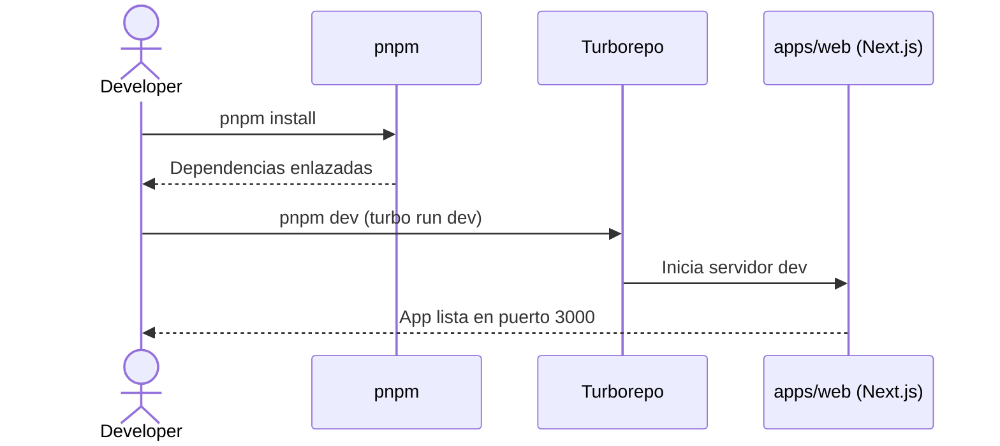

# Issue #1 — Setup Monorepo Next.js + pnpm + Turborepo

**Milestone:** v0.1 — Setup Base
**Branch:** `chore/issue-1-setup-monorepo`
**Estado:** ✅ COMPLETADA

---

## Historia de Usuario

Como desarrollador principal, quiero inicializar un monorepo con pnpm workspaces y Turborepo que contenga la app Next.js y los paquetes locales (`@fluxsql/parsers`, `@fluxsql/ui`), para compartir código eficientemente y optimizar los tiempos de build.

---

## Criterios de Aceptación

- [x] `pnpm-workspace.yaml` incluye `apps/*` y `packages/*`
- [x] `turbo run build` compila la app web y los paquetes dependientes
- [x] Next.js App Router levanta en puerto 3000 sin errores de dependencias cruzadas

---

## Estado Actual — Todo verificado

```
pnpm build → ✅ 1 successful, 3 packages en scope (parsers, ui, web)
Next.js 16.2.4 con Turbopack → ✅ compilado en 2.4s
```

---

## Arquitectura del Monorepo

### Por qué esta estructura

El monorepo permite que `@fluxsql/parsers` sea importado por `apps/web` como si fuera un paquete npm, pero sin publicarlo. Turborepo detecta el grafo de dependencias y solo recompila lo que cambió.

### Reglas de dependencias entre workspaces

- `apps/web` puede depender de `packages/parsers` y `packages/ui`
- `packages/parsers` NO puede depender de `apps/web` ni de `packages/ui`
- `packages/ui` NO puede depender de `packages/parsers`

Violar estas reglas genera dependencias circulares que rompen el build.

### Instalar dependencias correctamente

```bash
# En la raíz del monorepo (devDependencies compartidas)
pnpm add <paquete> -D -w

# En un workspace específico
pnpm add <paquete> --filter web
pnpm add <paquete> --filter parsers

# Instalar todo desde cero
pnpm install
```

### Agregar un nuevo paquete local

1. Crear carpeta en `packages/nuevo-paquete/`
2. Crear `packages/nuevo-paquete/package.json` con `"name": "@fluxsql/nuevo-paquete"`
3. En `apps/web/package.json` agregar: `"@fluxsql/nuevo-paquete": "workspace:*"`
4. Ejecutar `pnpm install`

---

## Archivos Clave

### `pnpm-workspace.yaml`
```yaml
packages:
  - "apps/*"
  - "packages/*"
```

### `turbo.json`
```json
{
  "$schema": "https://turbo.build/schema.json",
  "tasks": {
    "build": {
      "dependsOn": ["^build"],
      "outputs": [".next/**", "!.next/cache/**", "dist/**"]
    },
    "dev": {
      "cache": false,
      "persistent": true
    },
    "lint": {
      "dependsOn": ["^build"]
    },
    "test": {
      "dependsOn": ["^build"],
      "outputs": ["coverage/**"]
    },
    "clean": {
      "cache": false
    }
  }
}
```

### `package.json` (raíz)
```json
{
  "scripts": {
    "build": "turbo run build",
    "dev":   "turbo run dev",
    "lint":  "turbo run lint",
    "test":  "turbo run test",
    "clean": "turbo run clean"
  }
}
```

---

## Errores Comunes y Cómo Evitarlos

| Error | Causa | Solución |
|---|---|---|
| `"build" no se reconoce` | Falta el script en `package.json` raíz | Agregar `"build": "turbo run build"` |
| `Module not found: @fluxsql/parsers` | Dependencia no declarada en `package.json` de `apps/web` | Agregar `"@fluxsql/parsers": "workspace:*"` y `pnpm install` |
| Turbo no detecta cambios | `outputs` mal configurados en `turbo.json` | Verificar que los outputs coincidan con lo que genera el build |
| `pnpm install` falla en CI | `pnpm-lock.yaml` desactualizado | Usar `pnpm install --frozen-lockfile` solo en CI |

---

## Verificación Final

```bash
pnpm build   # Debe pasar sin errores
pnpm dev     # Debe levantar Next.js en http://localhost:3000
```

---

## Diagrama de Secuencia


