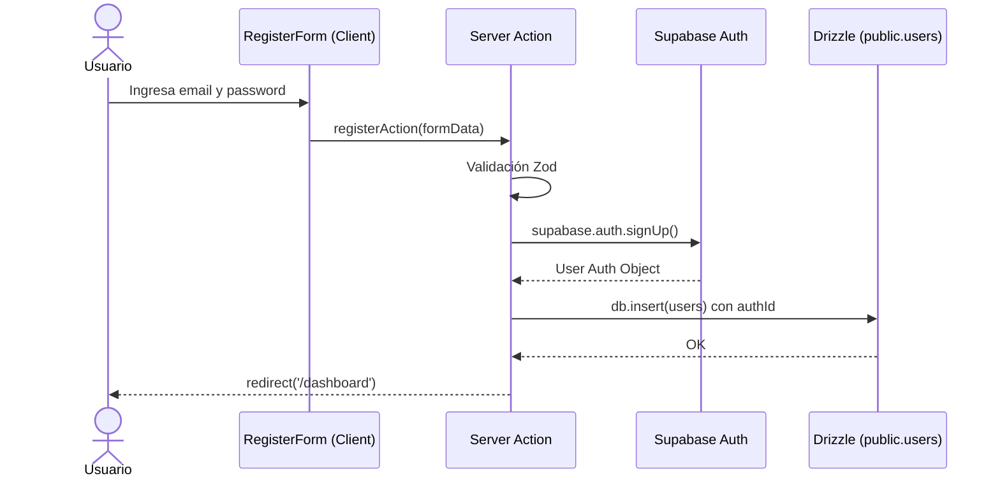

# Issue #3 — Auth: Registro de Usuario

**Milestone:** v0.1 — Setup Base
**Branch:** `feat/issue-3-auth-register`
**Depende de:** Issue #2 ✅
**Estado:** ⬜ Pendiente

---

## Historia de Usuario

Como nuevo usuario de FluxSQL, quiero registrarme con correo y contraseña para crear una cuenta donde se almacenarán mis diagramas de forma privada.

---

## Criterios de Aceptación

- [ ] Ruta `/register` con formulario funcional conectado a Supabase Auth
- [ ] Validación: correo con formato válido, contraseña mínimo 6 caracteres
- [ ] Al registrarse en Supabase Auth, se inserta registro en la tabla pública `users` vía Drizzle

---

## Arquitectura

### Flujo completo de registro

```
/register (Client Component)
    │
    ▼ onSubmit → Server Action
registerAction(formData)
    │
    ├── 1. Validar con Zod
    ├── 2. supabase.auth.signUp()  → crea en auth.users
    ├── 3. db.insert(users)        → crea en public.users
    └── 4. redirect('/dashboard')
```

### Por qué necesitas insertar manualmente en `public.users`

Supabase Auth crea el usuario en `auth.users` (esquema interno). Tu tabla `public.users` es tuya y Supabase **no la llena automáticamente**. Tienes dos opciones:

- **Opción A (recomendada para este proyecto):** Insertar desde el Server Action justo después del `signUp()`. Simple, sin configuración extra.
- **Opción B:** Crear un trigger en PostgreSQL que se dispare automáticamente al insertar en `auth.users`. Más robusto pero requiere SQL en Supabase.

**Usa la Opción A** — es suficiente para este proyecto y más fácil de depurar.

---

## Patrones y Reglas

### Dos clientes de Supabase — nunca los mezcles

```
lib/supabase/
├── client.ts   → createBrowserClient()  — para Client Components ("use client")
└── server.ts   → createServerClient()   — para Server Components y Server Actions
```

El cliente del servidor lee y escribe cookies de sesión. El del browser no puede hacer eso en SSR.

### Validación con Zod antes de tocar la base de datos

```typescript
// Siempre validar en el Server Action, no confiar en validación del cliente
const RegisterSchema = z.object({
  email: z.string().email("Correo inválido"),
  password: z.string().min(6, "Mínimo 6 caracteres"),
})

// Si falla la validación, retornar error (no lanzar excepción)
const result = RegisterSchema.safeParse({ email, password })
if (!result.success) return { error: result.error.errors[0].message }
```

### Manejo de errores — retornar, no lanzar

```typescript
// ✅ CORRECTO — el error se muestra en el formulario
if (authError) return { error: authError.message }

// ❌ INCORRECTO — Next.js muestra una pantalla de error genérica
if (authError) throw new Error(authError.message)
```

### Transaccionalidad — qué hacer si falla el insert en `public.users`

Si el `signUp()` de Supabase Auth tiene éxito pero el `db.insert(users)` falla, el usuario existe en `auth.users` pero no en `public.users`. Para manejar este caso:

```typescript
// Si falla la inserción en public.users, eliminar de auth también
const { data, error: authError } = await supabase.auth.signUp(...)
if (authError) return { error: authError.message }

try {
  await db.insert(users).values({ authId: data.user!.id, email })
} catch (dbError) {
  // Rollback: eliminar el usuario de auth para mantener consistencia
  await supabase.auth.admin.deleteUser(data.user!.id)
  return { error: 'Error al crear el perfil. Intenta de nuevo.' }
}
```

---

## Estructura de Archivos

```
apps/web/
├── app/
│   └── (public)/
│       └── register/
│           └── page.tsx          ← Página de registro (Server Component wrapper)
├── components/
│   └── auth/
│       └── RegisterForm.tsx      ← Formulario (Client Component con "use client")
├── actions/
│   └── auth/
│       └── register.ts           ← Server Action
└── lib/
    └── supabase/
        ├── client.ts             ← Para Client Components
        └── server.ts             ← Para Server Actions/Components
```

---

## UI — Identidad Visual FluxSQL

El formulario de registro sigue la paleta del sistema:

- **Fondo de página:** `#0A0F1E`
- **Card del formulario:** `#111827` con borde `#1E2A45`
- **Inputs:** borde `#1E2A45`, focus ring `#1A6CF6`
- **Botón primario:** `bg-[#1A6CF6]` con hover más oscuro
- **Errores:** `text-red-400` (no usar shadcn `destructive` sin ajustar al tema)

Componentes de shadcn a usar: `Input`, `Button`, `Label`, `Card`. No crear inputs o botones desde cero.

---

## Errores Comunes y Cómo Evitarlos

| Error | Causa | Solución |
|---|---|---|
| `User already registered` | Correo ya existe en Supabase Auth | Mostrar mensaje amigable, no el error crudo de Supabase |
| `Invalid API key` | Usando `service_role_key` en el cliente del browser | Solo usar `anon_key` en `NEXT_PUBLIC_SUPABASE_ANON_KEY` |
| Usuario en auth pero no en `public.users` | Insert en DB falló silenciosamente | Implementar el rollback descrito arriba |
| Redirección no funciona | `redirect()` usado dentro de try/catch | `redirect()` lanza una excepción internamente — llamarlo fuera del try/catch |

---

## Verificación Final

```bash
# 1. Ir a http://localhost:3000/register
# 2. Registrar un usuario nuevo con correo y contraseña válidos
# 3. Verificar en Supabase Dashboard:
#    - Authentication > Users → el usuario aparece en auth.users
#    - Table Editor > users → el usuario aparece en public.users
# 4. Verificar redirección a /dashboard después del registro
```

---

## Diagrama de Secuencia


