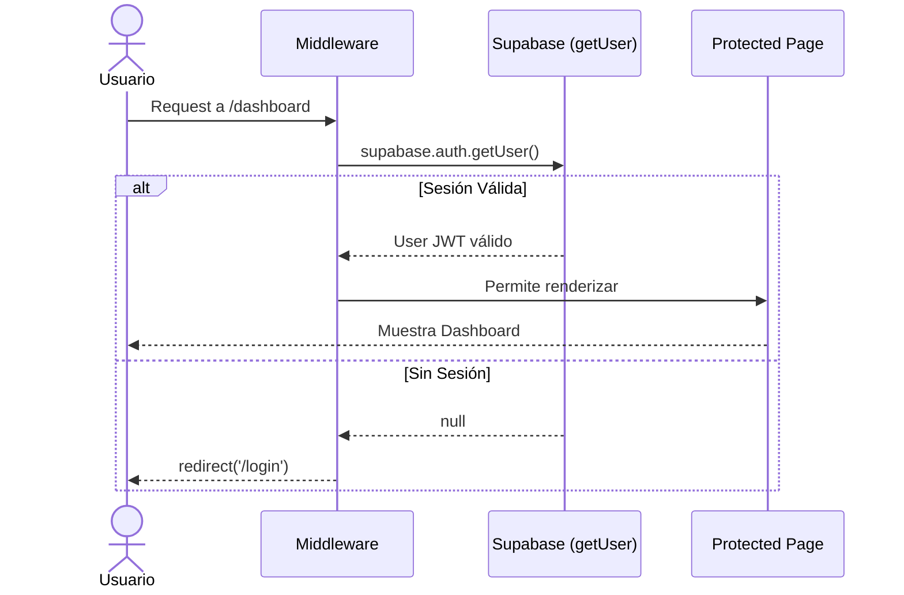

# Issue #4 — Auth: Login y Sesión

**Milestone:** v0.1 — Setup Base
**Branch:** `feat/issue-4-auth-login`
**Depende de:** Issue #3 ✅
**Estado:** ⬜ Pendiente

---

## Historia de Usuario

Como usuario registrado de FluxSQL, quiero iniciar sesión y mantener mi sesión activa, para acceder a mis proyectos sin autenticarme en cada recarga.

---

## Criterios de Aceptación

- [ ] Ruta `/login` con formulario funcional conectado a Supabase Auth
- [ ] Middleware en Next.js protege `/dashboard` y `/editor`
- [ ] Sesión persistida correctamente con cookies de Supabase (SSR support)

---

## Arquitectura

### El Middleware — pieza más crítica de esta issue

El `middleware.ts` se ejecuta **antes** de que Next.js renderice cualquier página. Su trabajo es:

1. Leer la cookie de sesión de Supabase
2. Si la ruta es protegida y no hay sesión → redirigir a `/login`
3. Si hay sesión → refrescar el token si está próximo a expirar y continuar

```
Request del usuario
       │
       ▼
middleware.ts (intercepta TODAS las rutas)
       │
       ├── ¿Ruta pública? (/login, /register, /) → Dejar pasar
       └── ¿Ruta protegida? (/dashboard, /editor)
               │
               ├── ¿Tiene cookie válida? → Continuar + refrescar token
               └── ¿Sin sesión? → redirect('/login')
```

### Ubicación del middleware

`middleware.ts` va en la raíz de `apps/web/` (al mismo nivel que `app/`), no dentro de `app/`.

```
apps/web/
├── app/
├── middleware.ts    ← AQUÍ, no dentro de app/
└── ...
```

---

## Patrones y Reglas

### El middleware DEBE usar `createServerClient` de `@supabase/ssr`

El patrón oficial de Supabase SSR para Next.js requiere pasar las cookies manualmente. Si usas el cliente incorrecto, la sesión no se refresca y el usuario es redirigido a login aunque tenga sesión válida.

```typescript
// middleware.ts — patrón obligatorio de @supabase/ssr
const supabase = createServerClient(url, key, {
  cookies: {
    getAll() { return request.cookies.getAll() },
    setAll(cookiesToSet) {
      // IMPORTANTE: actualizar TANTO request como response
      cookiesToSet.forEach(({ name, value }) => request.cookies.set(name, value))
      supabaseResponse = NextResponse.next({ request })
      cookiesToSet.forEach(({ name, value, options }) =>
        supabaseResponse.cookies.set(name, value, options)
      )
    },
  },
})
```

### Siempre usar `getUser()`, nunca `getSession()` para validar

```typescript
// ✅ CORRECTO — valida el token con el servidor de Supabase
const { data: { user } } = await supabase.auth.getUser()

// ❌ INCORRECTO — solo lee la cookie, no valida si el token fue revocado
const { data: { session } } = await supabase.auth.getSession()
```

`getSession()` puede devolver una sesión "válida" aunque el token haya sido revocado. Siempre usar `getUser()` en el middleware.

### Rutas protegidas y públicas — definir explícitamente

```typescript
const PUBLIC_ROUTES = ['/', '/login', '/register']
const isPublicRoute = PUBLIC_ROUTES.some(route => 
  request.nextUrl.pathname === route || 
  request.nextUrl.pathname.startsWith('/share/') // links públicos de solo lectura
)
```

### Matcher del middleware — no interceptar assets estáticos

```typescript
export const config = {
  matcher: [
    // Excluir archivos estáticos y rutas internas de Next.js
    '/((?!_next/static|_next/image|favicon.ico|.*\.(?:svg|png|jpg|jpeg|gif|webp)$).*)',
  ],
}
```

Sin este matcher, el middleware corre para cada imagen y CSS, lo que degrada el rendimiento.

### Server Action de login — manejo correcto de errores

Supabase devuelve mensajes de error genéricos en inglés. Traducirlos para el usuario:

```typescript
const ERROR_MAP: Record<string, string> = {
  'Invalid login credentials': 'Correo o contraseña incorrectos',
  'Email not confirmed': 'Debes confirmar tu correo antes de iniciar sesión',
  'Too many requests': 'Demasiados intentos. Espera unos minutos.',
}

const friendlyError = ERROR_MAP[error.message] ?? 'Error al iniciar sesión. Intenta de nuevo.'
return { error: friendlyError }
```

---

## Estructura de Archivos

```
apps/web/
├── app/
│   └── (public)/
│       └── login/
│           └── page.tsx              ← Página login
├── components/
│   └── auth/
│       └── LoginForm.tsx             ← Formulario (Client Component)
├── actions/
│   └── auth/
│       ├── login.ts                  ← Server Action de login
│       └── logout.ts                 ← Server Action de logout
└── middleware.ts                     ← Protección de rutas (raíz de apps/web)
```

---

## Logout

El logout también necesita un Server Action para limpiar las cookies del servidor:

```typescript
// actions/auth/logout.ts
'use server'
import { createClient } from '@/lib/supabase/server'
import { redirect } from 'next/navigation'

export async function logoutAction() {
  const supabase = await createClient()
  await supabase.auth.signOut()
  redirect('/login')
}
```

No uses `supabase.auth.signOut()` desde un Client Component directamente — las cookies del servidor no se limpian correctamente.

---

## Errores Comunes y Cómo Evitarlos

| Error | Causa | Solución |
|---|---|---|
| Usuario con sesión válida redirigido a `/login` | Usando `getSession()` en lugar de `getUser()` | Cambiar a `getUser()` |
| Cookie no se actualiza / token no se refresca | Middleware no actualiza `supabaseResponse.cookies` | Seguir el patrón `setAll` que actualiza tanto request como response |
| Middleware corre para imágenes y CSS | Matcher muy amplio | Agregar el matcher que excluye `_next/static` y extensiones de imagen |
| `redirect()` dentro de try/catch no funciona | `redirect()` lanza un error especial que catch captura | Llamar `redirect()` fuera del bloque try/catch |

---

## Verificación Final

```bash
# 1. Iniciar sesión en http://localhost:3000/login con un usuario registrado
# 2. Verificar redirección a /dashboard
# 3. Intentar acceder a http://localhost:3000/dashboard SIN sesión → debe redirigir a /login
# 4. Intentar acceder a http://localhost:3000/editor/cualquier-id SIN sesión → debe redirigir a /login
# 5. Con sesión activa, recargar /dashboard → NO debe pedir login de nuevo
```

---

## Diagrama de Secuencia


