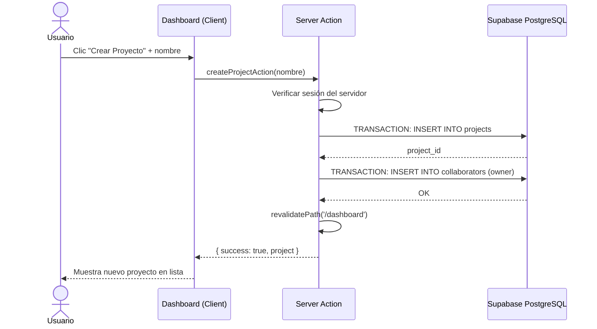

# Issue #5 — Crear y Listar Proyectos

**Milestone:** v0.1 — Setup Base
**Branch:** `feat/issue-5-crud-projects`
**Depende de:** Issues #2, #3, #4 ✅
**Estado:** ⬜ Pendiente

---

## Historia de Usuario

Como estudiante con sesión iniciada, quiero crear proyectos y ver la lista de los proyectos donde soy propietario o colaborador, para organizar mis diseños de base de datos por cursos.

---

## Criterios de Aceptación

- [ ] Dashboard muestra lista de proyectos del usuario desde tabla `projects` vía Drizzle
- [ ] Botón/modal para crear proyecto solicitando nombre y descripción
- [ ] Al crear, el creador se asigna automáticamente como `owner` en `collaborators`

---

## Arquitectura

### El Dashboard es un Server Component

El dashboard carga los proyectos en el servidor antes de renderizar. No hay loading spinners ni fetches del cliente. Esto garantiza que la página llegue al usuario ya con los datos.

```
/dashboard/page.tsx  (Server Component)
    │
    ├── Lee la sesión del usuario (createClient del servidor)
    ├── Consulta Drizzle: proyectos donde el usuario es colaborador
    └── Pasa los proyectos como props a ProjectList (Client Component)
         │
         └── ProjectList renderiza tarjetas + botón "Nuevo Proyecto"
              │
              └── Al hacer clic → Abre modal (CreateProjectModal)
                   │
                   └── onSubmit → Server Action createProjectAction()
```

### Por qué dos operaciones en una sola acción (INSERT project + INSERT collaborator)

Crear un proyecto implica dos inserts atómicos: el proyecto en `projects` y el owner en `collaborators`. Si el segundo falla, el proyecto queda huérfano (sin owner). Usar una transacción de Drizzle garantiza que ambos ocurren o ninguno:

```typescript
await db.transaction(async (tx) => {
  const [project] = await tx.insert(projects).values(...).returning()
  await tx.insert(collaborators).values({ projectId: project.id, userId, role: 'owner' })
})
```

### Consulta del dashboard — solo proyectos del usuario

```typescript
// Solo traer proyectos donde el usuario es colaborador (owner, editor o viewer)
const userProjects = await db
  .select({ project: projects })
  .from(projects)
  .innerJoin(collaborators, eq(collaborators.projectId, projects.id))
  .where(eq(collaborators.userId, dbUser.id))
  .orderBy(desc(projects.updatedAt))
```

---

## Patrones y Reglas

### Seguridad — Nunca confiar en el user_id del cliente

```typescript
// ❌ INCORRECTO — el cliente puede falsificar el userId
export async function createProjectAction(name: string, userId: string) { ... }

// ✅ CORRECTO — extraer el user de la sesión del servidor
export async function createProjectAction(name: string) {
  const supabase = await createClient()
  const { data: { user } } = await supabase.auth.getUser()
  if (!user) return { error: 'No autenticado' }
  // Usar user.id para buscar en public.users
}
```

### revalidatePath después de mutations

Después de crear un proyecto, Next.js debe saber que el cache del dashboard es inválido:

```typescript
revalidatePath('/dashboard')
// NO usar redirect() aquí — dejar que el cliente maneje la navegación
// después de recibir el resultado exitoso de la acción
```

### Empty State — no dejar pantalla vacía

Cuando el usuario no tiene proyectos, mostrar un estado vacío motivador:

```
┌─────────────────────────────────────┐
│                                     │
│    [Ícono de base de datos]         │
│                                     │
│    Aún no tienes proyectos          │
│    Crea tu primer diagrama de BD    │
│                                     │
│    [+ Crear mi primer proyecto]     │
│                                     │
└─────────────────────────────────────┘
```

Componentes de shadcn a usar: `Dialog`, `DialogTrigger`, `DialogContent` para el modal. `Card` para las tarjetas de proyecto.

---

## Estructura de Archivos

```
apps/web/
├── app/
│   └── (protected)/
│       └── dashboard/
│           └── page.tsx                  ← Server Component (lee datos)
├── components/
│   └── dashboard/
│       ├── ProjectList.tsx               ← Client Component (lista + modal)
│       ├── ProjectCard.tsx               ← Tarjeta individual de proyecto
│       ├── CreateProjectModal.tsx        ← Modal con formulario
│       └── EmptyState.tsx               ← Estado vacío
└── actions/
    └── projects/
        ├── create.ts                     ← createProjectAction()
        └── list.ts                       ← getProjectsByUser() (helper, no action)
```

---

## UI — Identidad Visual FluxSQL

### Tarjeta de proyecto (ProjectCard)
- Fondo: `#111827`, borde: `#1E2A45`
- Header con nombre del proyecto en `#E2E8F0`
- Badge de rol (owner/editor) en cian `#00D4FF` con fondo semitransparente
- Footer con fecha de actualización en `#94A3B8`
- Hover: borde cambia a `#1A6CF6`, leve elevación con box-shadow

### Modal de creación
- Overlay oscuro sobre el canvas
- Input de nombre: obligatorio, max 50 caracteres
- Textarea de descripción: opcional, max 200 caracteres
- Botón primario: `bg-[#1A6CF6]` — "Crear Proyecto"
- Botón cancelar: ghost, solo texto

---

## Errores Comunes y Cómo Evitarlos

| Error | Causa | Solución |
|---|---|---|
| Proyecto creado sin owner | No se insertó en `collaborators` | Usar transacción que incluye ambos inserts |
| Dashboard no se actualiza tras crear | Falta `revalidatePath('/dashboard')` | Agregar al final del Server Action |
| Usuario ve proyectos de otros | Consulta sin filtrar por `collaborators.userId` | Siempre hacer el JOIN con `collaborators` |
| Modal no cierra tras éxito | No se maneja el resultado de la acción | Cerrar el dialog cuando la acción retorna sin error |

---

## Verificación Final

```bash
# 1. Ir a /dashboard con sesión activa → verificar empty state si no hay proyectos
# 2. Crear un proyecto con nombre "SI783-BaseDatos"
# 3. Verificar en Supabase:
#    - Table Editor > projects → fila con ese nombre
#    - Table Editor > collaborators → fila con role='owner' apuntando al proyecto
# 4. El dashboard debe mostrar el nuevo proyecto sin recargar la página
# 5. Verificar que solo se muestran los proyectos del usuario actual (no de otros)
```

---

## Diagrama de Secuencia


