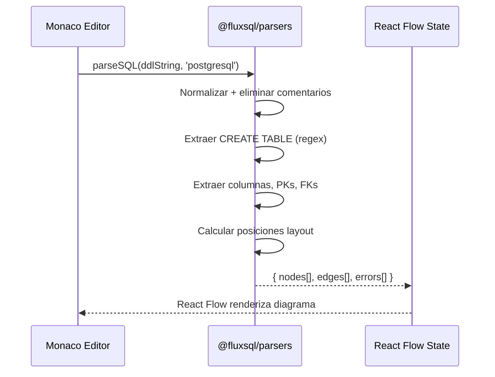

# Issue #6 — Parser SQL PostgreSQL → Nodos React Flow

**Milestone:** v0.1 — Setup Base
**Branch:** `feat/issue-6-parser-postgresql`
**Depende de:** Issue #2 ✅
**Estado:** ⬜ Pendiente

---

## Historia de Usuario

Como arquitecto de base de datos, quiero pegar DDL de PostgreSQL y que el sistema lo transforme a una estructura JSON compatible con React Flow, para generar automáticamente el diagrama ER sin arrastrar cajas manualmente.

---

## Criterios de Aceptación

- [ ] Función pura `parseSQL(ddl, dialect)` en `@fluxsql/parsers` que retorna `{ nodes[], edges[], errors[] }`
- [ ] Identifica `CREATE TABLE`, columnas, tipos de datos y PKs de PostgreSQL
- [ ] Detecta `REFERENCES` (FKs) para construir edges entre nodos
- [ ] Nunca lanza excepciones — errores van en `errors[]`

---

## Arquitectura

### Ubicación — paquete `@fluxsql/parsers`

El parser va en el paquete independiente, NO en `apps/web`:

```
packages/parsers/
├── src/
│   ├── index.ts           ← Exporta parseSQL() y parseJSON()
│   ├── types.ts           ← ParseResult, FlowNode, FlowEdge, ParseError
│   ├── dialects/
│   │   └── postgresql.ts  ← Reglas específicas de PostgreSQL
│   └── utils/
│       └── layout.ts      ← Calcula posiciones x,y de los nodos
├── package.json           ← "name": "@fluxsql/parsers"
└── tsconfig.json
```

### Por qué el parser es un paquete separado y no está en `apps/web`

- Es TypeScript puro sin dependencias del browser ni de React
- Puede testearse de forma completamente independiente
- En el futuro puede publicarse como paquete npm
- `apps/web` lo importa como `import { parseSQL } from '@fluxsql/parsers'`

### Por qué corre en el cliente (browser) y no en el servidor

El parser se ejecuta cada vez que el usuario teclea (debounce 300ms). Una llamada al servidor por cada pausa introduciría latencia de red que rompería la experiencia de feedback instantáneo. El parser es puro TypeScript y funciona perfectamente en el browser.

---

## Contrato de la API — tipos obligatorios

```typescript
// packages/parsers/src/types.ts

export interface ParseResult {
  nodes: FlowNode[]
  edges: FlowEdge[]
  errors: ParseError[]
}

export interface FlowNode {
  id: string           // nombre de la tabla en minúsculas: "users"
  type: 'tableNode'    // tipo custom de React Flow
  position: { x: number; y: number }
  data: {
    tableName: string
    columns: Column[]
  }
}

export interface Column {
  name: string
  type: string         // ej: "UUID", "TEXT", "INTEGER"
  isPrimaryKey: boolean
  isForeignKey: boolean
  references?: {
    table: string
    column: string
  }
}

export interface FlowEdge {
  id: string           // "fk-orders-users" 
  source: string       // id del nodo origen (tabla con FK)
  target: string       // id del nodo destino (tabla referenciada)
  sourceHandle?: string
  targetHandle?: string
  type: 'smoothstep'
  animated: false
  style: { stroke: '#00D4FF' }
}

export interface ParseError {
  line?: number
  message: string
}
```

---

## Patrones y Reglas

### Función principal — nunca lanza excepciones

```typescript
// packages/parsers/src/index.ts
export function parseSQL(
  ddl: string,
  dialect: 'postgresql' | 'mysql' | 'sqlserver' = 'postgresql'
): ParseResult {
  // Siempre retorna el objeto, incluso si hay errores
  try {
    // lógica de parsing
  } catch (err) {
    return {
      nodes: [],
      edges: [],
      errors: [{ message: err instanceof Error ? err.message : 'Error desconocido' }]
    }
  }
}
```

### Pipeline de parsing para PostgreSQL

```
String DDL
    │
    ▼
1. Normalizar: eliminar comentarios (-- y /* */), colapsar whitespace
    │
    ▼
2. Extraer bloques CREATE TABLE con regex:
   /CREATE\s+TABLE\s+(?:IF\s+NOT\s+EXISTS\s+)?["']?(\w+)["']?\s*\(([\s\S]*?)\);/gi
    │
    ▼
3. Por cada bloque, extraer columnas:
   - Nombre y tipo: /(\w+)\s+([\w\(\),\s]+?)(?:\s+.*)?(?:,|$)/
   - PRIMARY KEY inline: columna que contiene PRIMARY KEY
   - PRIMARY KEY al final del bloque: PRIMARY KEY (col1, col2)
    │
    ▼
4. Extraer REFERENCES para construir edges:
   /REFERENCES\s+["']?(\w+)["']?\s*\(["']?(\w+)["']?\)/gi
    │
    ▼
5. Calcular posiciones x,y en grid (evitar solapamiento)
    │
    ▼
6. Retornar { nodes, edges, errors }
```

### Layout automático — distribución en grid

Los nodos deben tener posiciones iniciales que no se solapen. Usa un grid simple:

```typescript
// packages/parsers/src/utils/layout.ts
const COLS = 3
const NODE_WIDTH = 280
const NODE_HEIGHT_BASE = 120
const GAP_X = 80
const GAP_Y = 60

export function calculateLayout(nodeCount: number): Array<{x: number, y: number}> {
  return Array.from({ length: nodeCount }, (_, i) => ({
    x: (i % COLS) * (NODE_WIDTH + GAP_X),
    y: Math.floor(i / COLS) * (NODE_HEIGHT_BASE + GAP_Y)
  }))
}
```

---

## Casos de prueba manuales

### Input válido PostgreSQL

```sql
CREATE TABLE users (
  id UUID PRIMARY KEY DEFAULT gen_random_uuid(),
  email TEXT NOT NULL UNIQUE,
  name TEXT,
  created_at TIMESTAMPTZ DEFAULT NOW()
);

CREATE TABLE projects (
  id UUID PRIMARY KEY DEFAULT gen_random_uuid(),
  name TEXT NOT NULL,
  owner_id UUID NOT NULL REFERENCES users(id) ON DELETE CASCADE,
  created_at TIMESTAMPTZ DEFAULT NOW()
);
```

### Output esperado

```json
{
  "nodes": [
    {
      "id": "users",
      "type": "tableNode",
      "position": { "x": 0, "y": 0 },
      "data": {
        "tableName": "users",
        "columns": [
          { "name": "id", "type": "UUID", "isPrimaryKey": true, "isForeignKey": false },
          { "name": "email", "type": "TEXT", "isPrimaryKey": false, "isForeignKey": false },
          { "name": "name", "type": "TEXT", "isPrimaryKey": false, "isForeignKey": false },
          { "name": "created_at", "type": "TIMESTAMPTZ", "isPrimaryKey": false, "isForeignKey": false }
        ]
      }
    },
    {
      "id": "projects",
      "type": "tableNode",
      "position": { "x": 360, "y": 0 },
      "data": {
        "tableName": "projects",
        "columns": [
          { "name": "id", "type": "UUID", "isPrimaryKey": true, "isForeignKey": false },
          { "name": "name", "type": "TEXT", "isPrimaryKey": false, "isForeignKey": false },
          { "name": "owner_id", "type": "UUID", "isPrimaryKey": false, "isForeignKey": true, "references": { "table": "users", "column": "id" } },
          { "name": "created_at", "type": "TIMESTAMPTZ", "isPrimaryKey": false, "isForeignKey": false }
        ]
      }
    }
  ],
  "edges": [
    {
      "id": "fk-projects-users",
      "source": "projects",
      "target": "users",
      "type": "smoothstep",
      "animated": false,
      "style": { "stroke": "#00D4FF" }
    }
  ],
  "errors": []
}
```

---

## Errores Comunes y Cómo Evitarlos

| Error | Causa | Solución |
|---|---|---|
| Parser importado en Server Component | `@fluxsql/parsers` usa browser APIs | Solo importar en Client Components con `"use client"` |
| Regex falla con tipos complejos | `VARCHAR(255)`, `NUMERIC(10,2)` contienen paréntesis | Usar regex no-greedy y capturar hasta la primera coma/paréntesis |
| Nodos solapados en el canvas | Todos con `position: {x:0, y:0}` | Usar `calculateLayout()` del utils |
| FK no detectada | `REFERENCES` en mayúsculas distintas | Usar flag `i` en regex: `/REFERENCES/gi` |

---

## Verificación Final

```typescript
// Prueba manual en Node.js o en el browser console
import { parseSQL } from '@fluxsql/parsers'

const ddl = `
CREATE TABLE users (id UUID PRIMARY KEY, email TEXT);
CREATE TABLE posts (id UUID PRIMARY KEY, user_id UUID REFERENCES users(id));
`

const result = parseSQL(ddl, 'postgresql')
console.assert(result.nodes.length === 2, 'Debe tener 2 nodos')
console.assert(result.edges.length === 1, 'Debe tener 1 edge')
console.assert(result.errors.length === 0, 'Sin errores')
```

```bash
pnpm build  # Debe pasar en todo el monorepo
```

---

## Diagrama de Secuencia


