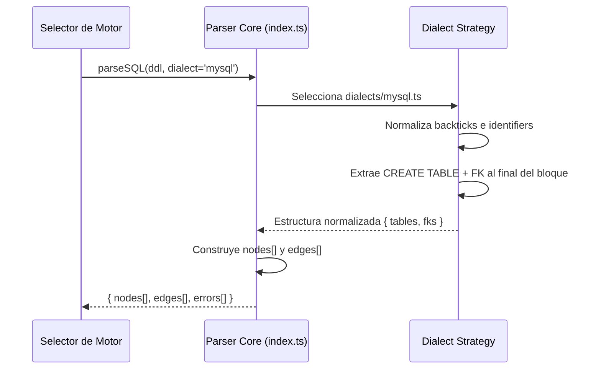

# Issue #7 — Parser T-SQL Server + MySQL

**Milestone:** v0.1 — Setup Base
**Branch:** `feat/issue-7-parser-sqlserver-mysql`
**Depende de:** Issue #6 ✅
**Estado:** ⬜ Pendiente

---

## Historia de Usuario

Como estudiante que usa diferentes motores de BD, quiero que el parser soporte T-SQL (SQL Server) y MySQL, para importar esquemas independientemente del motor que asigne el profesor.

---

## Criterios de Aceptación

- [ ] El parser acepta parámetro `dialect: 'postgresql' | 'mysql' | 'sqlserver'`
- [ ] Soporta tipos específicos: `AUTO_INCREMENT`, `IDENTITY`, `DATETIME2`, `VARCHAR2`
- [ ] Detecta FKs definidas via `ALTER TABLE ... ADD CONSTRAINT ... FOREIGN KEY`

---

## Arquitectura

### Patrón Strategy por dialecto

En lugar de un único parser con muchos `if/else`, cada dialecto tiene su propio módulo con las reglas específicas. El core llama al dialecto correcto:

```
packages/parsers/src/
├── index.ts                  ← parseSQL() decide qué dialecto usar
├── types.ts                  ← tipos compartidos (ya existe de Issue #6)
├── core.ts                   ← lógica compartida entre dialectos
├── dialects/
│   ├── postgresql.ts         ← ya existe de Issue #6
│   ├── mysql.ts              ← NUEVO
│   └── sqlserver.ts          ← NUEVO
└── utils/
    └── layout.ts             ← ya existe de Issue #6
```

### Por qué Strategy y no un único parser genérico

Las diferencias entre dialectos son profundas:
- MySQL usa backticks `` ` `` para identifiers, los otros no
- SQL Server define FKs casi siempre via `ALTER TABLE` separado del `CREATE TABLE`
- PostgreSQL tiene tipos como `UUID`, `JSONB`, `TIMESTAMPTZ` que no existen en MySQL
- Un único parser con todos los casos se vuelve imposible de mantener

---

## Diferencias por Dialecto

### PostgreSQL (ya implementado en Issue #6)
- Identifiers: sin quotes o con `"doble"`
- FKs: `REFERENCES tabla(col)` inline en la columna
- PKs: `PRIMARY KEY` inline o al final del CREATE TABLE
- Tipos únicos: `UUID`, `JSONB`, `TIMESTAMPTZ`, `SERIAL`, `BIGSERIAL`

### MySQL
- Identifiers: con backticks `` `nombre` `` (obligatorio parsear y quitar)
- FKs: `CONSTRAINT fk_name FOREIGN KEY (col) REFERENCES tabla(col)` al final del CREATE TABLE
- PKs: inline o `PRIMARY KEY (col)` al final del bloque
- Tipos únicos: `AUTO_INCREMENT`, `TINYINT`, `MEDIUMTEXT`, `ENUM('a','b')`
- Engine al final: `ENGINE=InnoDB DEFAULT CHARSET=utf8mb4` — ignorar esto

### SQL Server (T-SQL)
- Identifiers: con `[corchetes]` (obligatorio parsear y quitar)
- FKs: casi siempre via `ALTER TABLE` SEPARADO del `CREATE TABLE`:
  ```sql
  ALTER TABLE dbo.Orders
  ADD CONSTRAINT FK_Orders_Users
  FOREIGN KEY (user_id) REFERENCES dbo.Users(id);
  ```
- PKs: `IDENTITY(1,1)` en la columna + `PRIMARY KEY` constraint
- Esquema prefijo: `dbo.NombreTabla` — extraer solo `NombreTabla`
- Tipos únicos: `NVARCHAR`, `DATETIME2`, `UNIQUEIDENTIFIER`, `BIT`, `MONEY`

---

## Patrones y Reglas

### Normalización de identifiers — primer paso para todos los dialectos

```typescript
// Quitar backticks de MySQL: `tabla` → tabla
function removeMysqlQuotes(str: string): string {
  return str.replace(/`([^`]+)`/g, '$1')
}

// Quitar corchetes de SQL Server: [tabla] → tabla
function removeSqlServerBrackets(str: string): string {
  return str.replace(/\[([^\]]+)\]/g, '$1')
}

// Quitar prefijo de esquema: dbo.tabla → tabla
function removeSchemaPrefix(name: string): string {
  return name.includes('.') ? name.split('.').pop()! : name
}
```

### SQL Server — acumulación en dos pasadas

SQL Server requiere dos pasadas sobre el DDL:

```typescript
// Pasada 1: extraer todas las tablas con sus columnas
const tables = extractCreateTables(normalizedDdl)

// Pasada 2: extraer ALTER TABLE y enlazar FKs a las tablas ya conocidas
const alterFks = extractAlterTableFks(normalizedDdl)
// Para cada FK encontrada, buscar la tabla correspondiente y añadir el edge
```

Sin las dos pasadas, las FKs definidas via `ALTER TABLE` al final del script no se detectan.

### Tipos de datos — normalización a formato display

Normalizar todos los tipos a mayúsculas para consistencia visual en el canvas:

```typescript
function normalizeType(rawType: string): string {
  return rawType
    .toUpperCase()
    .replace(/\s+/g, ' ')
    .trim()
  // "varchar(255)" → "VARCHAR(255)"
  // "int auto_increment" → "INT AUTO_INCREMENT" → quitar AUTO_INCREMENT del tipo
}
```

`AUTO_INCREMENT` e `IDENTITY` son constraints, no tipos de datos. Deben quedar como marcadores en la columna pero no en el `type`.

---

## Casos de prueba manuales

### MySQL input

```sql
CREATE TABLE `users` (
  `id` INT AUTO_INCREMENT PRIMARY KEY,
  `email` VARCHAR(255) NOT NULL UNIQUE,
  `name` VARCHAR(100)
) ENGINE=InnoDB;

CREATE TABLE `posts` (
  `id` INT AUTO_INCREMENT PRIMARY KEY,
  `title` VARCHAR(200),
  `user_id` INT NOT NULL,
  CONSTRAINT `fk_posts_users` FOREIGN KEY (`user_id`) REFERENCES `users` (`id`)
) ENGINE=InnoDB;
```

**Output esperado:** 2 nodos, 1 edge de `posts` → `users`

### SQL Server input

```sql
CREATE TABLE dbo.Users (
  id INT IDENTITY(1,1) NOT NULL,
  email NVARCHAR(255) NOT NULL,
  CONSTRAINT PK_Users PRIMARY KEY (id)
);

CREATE TABLE dbo.Orders (
  id INT IDENTITY(1,1) NOT NULL,
  user_id INT NOT NULL,
  CONSTRAINT PK_Orders PRIMARY KEY (id)
);

ALTER TABLE dbo.Orders
ADD CONSTRAINT FK_Orders_Users
FOREIGN KEY (user_id) REFERENCES dbo.Users(id);
```

**Output esperado:** 2 nodos (`users`, `orders` sin prefijo `dbo`), 1 edge

---

## Errores Comunes y Cómo Evitarlos

| Error | Causa | Solución |
|---|---|---|
| FK de MySQL no detectada | FK al final del CREATE TABLE, no inline | Parsear el bloque completo del CREATE TABLE buscando `FOREIGN KEY` además de `REFERENCES` inline |
| Tabla SQL Server duplicada | `dbo.Users` y `Users` se tratan como distintas | Normalizar siempre con `removeSchemaPrefix()` antes de guardar |
| `AUTO_INCREMENT` aparece en el tipo | No se separó del tipo | Detectar `AUTO_INCREMENT` y `IDENTITY` como flags de columna, removerlos del campo `type` |
| Backticks en el edge ID | ID contiene caracteres especiales | Normalizar IDs de nodos: solo `[a-zA-Z0-9_]`, reemplazar el resto con `_` |

---

## Verificación Final

```typescript
import { parseSQL } from '@fluxsql/parsers'

// MySQL
const mysqlResult = parseSQL(mysqlDDL, 'mysql')
console.assert(mysqlResult.nodes.length === 2)
console.assert(mysqlResult.edges.length === 1)
console.assert(mysqlResult.errors.length === 0)

// SQL Server
const tsqlResult = parseSQL(tsqlDDL, 'sqlserver')
console.assert(tsqlResult.nodes.length === 2)
console.assert(tsqlResult.edges.length === 1)
console.assert(tsqlResult.errors.length === 0)
```

```bash
pnpm build  # Todo el monorepo debe pasar
```

---

## Diagrama de Secuencia


