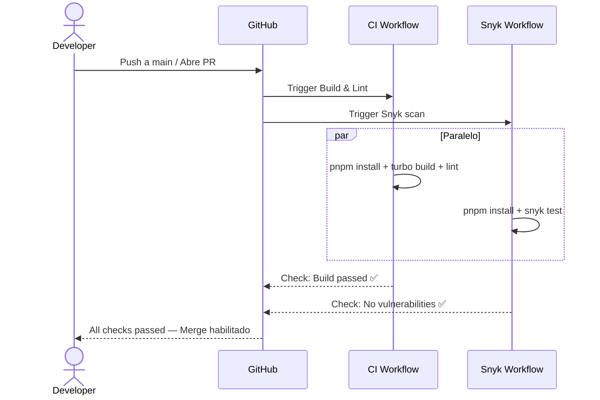

# Issue #8 — GitHub Actions CI + Snyk

**Milestone:** v0.1 — Setup Base
**Branch:** `chore/issue-8-ci-snyk`
**Depende de:** Issue #1 ✅
**Estado:** ⬜ Pendiente

---

## Historia de Usuario

Como responsable de CI/CD, quiero pipelines automatizados con GitHub Actions para compilar y escanear con Snyk, para mantener `main` siempre estable y libre de vulnerabilidades.

---

## Criterios de Aceptación

- [ ] `.github/workflows/ci.yml` instala pnpm, dependencias y ejecuta `turbo run build`
- [ ] `.github/workflows/snyk.yml` integrado con token de Snyk que bloquea PRs con vulnerabilidades altas
- [ ] Ambos workflows se disparan en Push y Pull Request a `main`

---

## Arquitectura

### Estructura de archivos

```
.github/
└── workflows/
    ├── ci.yml        ← Build + Lint (siempre corre)
    └── snyk.yml      ← Escaneo de seguridad (siempre corre)
```

### Por qué dos workflows separados y no uno solo

- **CI** puede fallar por errores de código (TypeScript, build)
- **Snyk** puede fallar por vulnerabilidades en dependencias
- Separarlos da feedback más claro en el PR: sabes exactamente qué falló
- Si fueran un solo workflow, un fallo de Snyk bloquearía ver el resultado del build

---

## Patrones y Reglas

### Configurar pnpm en GitHub Actions — siempre usar `setup-node` + `cache`

```yaml
- name: Setup Node.js
  uses: actions/setup-node@v4
  with:
    node-version: 20

- name: Setup pnpm
  uses: pnpm/action-setup@v4
  with:
    version: 10
    run_install: false

- name: Get pnpm store directory
  id: pnpm-cache
  run: echo "STORE_PATH=$(pnpm store path)" >> $GITHUB_OUTPUT

- name: Cache pnpm store
  uses: actions/cache@v4
  with:
    path: ${{ steps.pnpm-cache.outputs.STORE_PATH }}
    key: ${{ runner.os }}-pnpm-${{ hashFiles('**/pnpm-lock.yaml') }}
    restore-keys: ${{ runner.os }}-pnpm-
```

Sin el cache, cada ejecución descarga todas las dependencias desde npm (~2-3 min extra).

### Variables de entorno en CI — no exponer secrets en logs

El build de Next.js necesita las variables de entorno. Usar GitHub Secrets para los valores sensibles:

```yaml
env:
  NEXT_PUBLIC_SUPABASE_URL: ${{ secrets.NEXT_PUBLIC_SUPABASE_URL }}
  NEXT_PUBLIC_SUPABASE_ANON_KEY: ${{ secrets.NEXT_PUBLIC_SUPABASE_ANON_KEY }}
  DATABASE_URL: ${{ secrets.DATABASE_URL }}
```

**Importante:** Los secrets con `NEXT_PUBLIC_` deben agregarse igual en GitHub Secrets aunque sean "públicos". En CI no existe `.env.local`.

### Snyk — configuración de severidad

Para este proyecto, bloquear solo vulnerabilidades `high` y `critical`:

```yaml
- name: Run Snyk scan
  uses: snyk/actions/node@master
  with:
    args: --severity-threshold=high --all-projects
  env:
    SNYK_TOKEN: ${{ secrets.SNYK_TOKEN }}
```

Si usas `--severity-threshold=low`, cualquier dependencia con una vulnerabilidad menor bloqueará todos los PRs. Usa `high` para un balance razonable.

### Turbo Remote Cache en CI — opcional pero recomendado

Si el build tarda mucho en CI, activar Turbo Remote Cache:

```yaml
- name: Build with Turbo
  run: pnpm build
  env:
    TURBO_TOKEN: ${{ secrets.TURBO_TOKEN }}
    TURBO_TEAM: ${{ secrets.TURBO_TEAM }}
```

Sin esto, cada ejecución en CI recompila todo desde cero aunque nada haya cambiado.

---

## Archivos a crear

### `.github/workflows/ci.yml`

```yaml
name: CI — Build & Lint

on:
  push:
    branches: [main]
  pull_request:
    branches: [main]

jobs:
  build:
    name: Build Monorepo
    runs-on: ubuntu-latest

    steps:
      - name: Checkout code
        uses: actions/checkout@v4

      - name: Setup pnpm
        uses: pnpm/action-setup@v4
        with:
          version: 10
          run_install: false

      - name: Setup Node.js 20
        uses: actions/setup-node@v4
        with:
          node-version: 20

      - name: Get pnpm store path
        id: pnpm-cache
        run: echo "STORE_PATH=$(pnpm store path)" >> $GITHUB_OUTPUT

      - name: Cache pnpm dependencies
        uses: actions/cache@v4
        with:
          path: ${{ steps.pnpm-cache.outputs.STORE_PATH }}
          key: ${{ runner.os }}-pnpm-${{ hashFiles('**/pnpm-lock.yaml') }}
          restore-keys: ${{ runner.os }}-pnpm-

      - name: Install dependencies
        run: pnpm install --frozen-lockfile

      - name: Build all packages
        run: pnpm build
        env:
          NEXT_PUBLIC_SUPABASE_URL: ${{ secrets.NEXT_PUBLIC_SUPABASE_URL }}
          NEXT_PUBLIC_SUPABASE_ANON_KEY: ${{ secrets.NEXT_PUBLIC_SUPABASE_ANON_KEY }}
          DATABASE_URL: ${{ secrets.DATABASE_URL }}

      - name: Lint all packages
        run: pnpm lint
```

### `.github/workflows/snyk.yml`

```yaml
name: Security — Snyk Vulnerability Scan

on:
  push:
    branches: [main]
  pull_request:
    branches: [main]

jobs:
  security:
    name: Snyk Security Scan
    runs-on: ubuntu-latest
    permissions:
      contents: read
      security-events: write

    steps:
      - name: Checkout code
        uses: actions/checkout@v4

      - name: Setup pnpm
        uses: pnpm/action-setup@v4
        with:
          version: 10
          run_install: false

      - name: Setup Node.js 20
        uses: actions/setup-node@v4
        with:
          node-version: 20

      - name: Install dependencies
        run: pnpm install --frozen-lockfile

      - name: Run Snyk vulnerability scan
        uses: snyk/actions/node@master
        with:
          args: --severity-threshold=high --all-projects
        env:
          SNYK_TOKEN: ${{ secrets.SNYK_TOKEN }}
```

---

## Configurar GitHub Secrets

Ve a tu repositorio → **Settings → Secrets and variables → Actions → New repository secret**

Agregar estos secrets:

| Secret | Valor |
|---|---|
| `NEXT_PUBLIC_SUPABASE_URL` | `https://xxxx.supabase.co` |
| `NEXT_PUBLIC_SUPABASE_ANON_KEY` | `eyJhbGci...` |
| `DATABASE_URL` | `postgresql://postgres...` |
| `SNYK_TOKEN` | Token de snyk.io (ver abajo) |

### Obtener el SNYK_TOKEN

1. Ir a [app.snyk.io](https://app.snyk.io)
2. Registrarse con la cuenta de GitHub
3. **Account Settings → Auth Token → copy**
4. Pegarlo como `SNYK_TOKEN` en GitHub Secrets

---

## Errores Comunes y Cómo Evitarlos

| Error | Causa | Solución |
|---|---|---|
| `Cannot find module` en CI | Falta `DATABASE_URL` en el env del step de build | Agregar todas las env vars al step `Build all packages` |
| `pnpm: command not found` | `pnpm/action-setup` va ANTES que `setup-node` | El orden correcto es: setup-node → pnpm/action-setup |
| Snyk falla en todos los PRs | `--severity-threshold=low` muy estricto | Cambiar a `--severity-threshold=high` |
| Build no usa cache de Turbo | Falta `TURBO_TOKEN` | Agregar el secret o aceptar builds lentos |
| `--frozen-lockfile` falla | `pnpm-lock.yaml` no está commiteado | Asegurarse de que `pnpm-lock.yaml` esté en el repo (no en .gitignore) |

---

## Verificación Final

1. Hacer push a `main` o abrir un PR
2. Ir a **GitHub → Actions** y verificar que ambos workflows aparecen
3. El workflow `CI — Build & Lint` debe mostrar ✅ verde
4. El workflow `Security — Snyk` debe mostrar ✅ verde
5. En el PR debe aparecer: `All checks have passed`

---

## Diagrama de Secuencia


