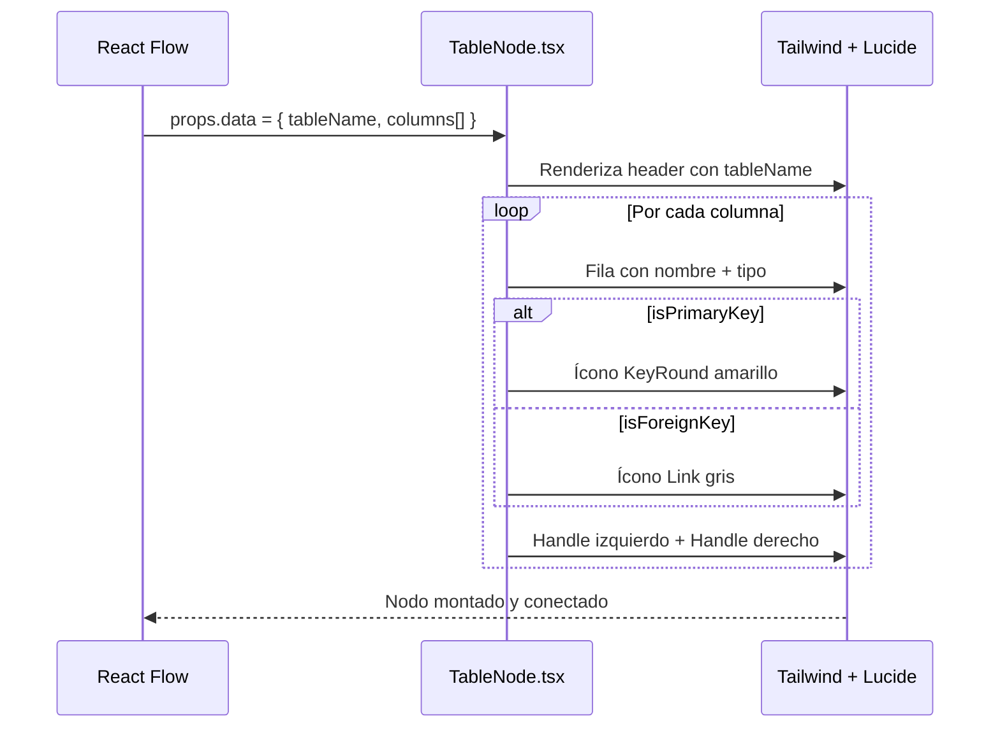

# Issue #10 — Nodos de Tabla Personalizados (columnas, tipos, PK/FK)

**Milestone:** v0.2 — Canvas + Editor
**Branch:** `feat/issue-10-custom-nodes`
**Depende de:** Issue #9 ✅
**Estado:** ⬜ Pendiente

---

## Historia de Usuario

Como estudiante de base de datos, quiero que los nodos muestren nombre de tabla, columnas, tipos y badges PK/FK para leer la estructura sin revisar el SQL.

---

## Criterios de Aceptación

- [ ] Componente `TableNode` registrado en `nodeTypes` de React Flow
- [ ] Header oscuro con nombre de tabla, body con lista de columnas
- [ ] Columnas PK muestran ícono de llave dorada
- [ ] Columnas FK muestran ícono de llave gris
- [ ] Handles (puntos de conexión) en cada fila de columna
- [ ] Estado vacío: "Sin columnas" en lugar de crash

---

## Arquitectura

### Estructura de archivos

```
components/editor/
├── Canvas.tsx                    ← ya existe — registrar TableNode aquí
├── nodes/
│   └── TableNode.tsx             ← NUEVO — componente del nodo personalizado
└── index.ts
```

### Contrato de datos que recibe el nodo

React Flow pasa los datos via `props.data`. La interfaz debe coincidir exactamente con `FlowNode.data` del parser:

```typescript
// El TableNode recibe exactamente esto:
interface TableNodeData {
  tableName: string
  columns: Column[]  // importado de @fluxsql/parsers
}
```

### Por qué los Handles van en cada fila de columna y no en los bordes del nodo

Las herramientas ERD profesionales (dbdiagram.io, Prisma Studio) conectan FK desde la columna específica, no desde el nodo genérico. Esto da mayor precisión visual al diagrama.

---

## Patrones y Reglas

### Componente TableNode completo

```tsx
// components/editor/nodes/TableNode.tsx
"use client"
import { Handle, Position } from "@xyflow/react"
import type { NodeProps } from "@xyflow/react"
import type { Column } from "@fluxsql/parsers"
import { KeyRound, Link } from "lucide-react"

interface TableNodeData {
  tableName: string
  columns: Column[]
}

export function TableNode({ data }: NodeProps<{ data: TableNodeData }>) {
  const { tableName, columns } = data

  return (
    <div className="min-w-[220px] rounded-lg overflow-hidden border border-[#1E2A45] shadow-lg">
      {/* Header */}
      <div className="bg-[#1A6CF6] px-3 py-2">
        <span className="text-white text-sm font-semibold tracking-wide">
          {tableName}
        </span>
      </div>

      {/* Columnas */}
      <div className="bg-[#111827] divide-y divide-[#1E2A45]">
        {columns.length === 0 ? (
          <div className="px-3 py-2 text-[#6B7280] text-xs italic">
            Sin columnas
          </div>
        ) : (
          columns.map((col, i) => (
            <div key={i} className="relative flex items-center gap-2 px-3 py-1.5 group">
              {/* Handle izquierdo — punto de entrada de FK */}
              <Handle
                type="target"
                position={Position.Left}
                id={`${col.name}-target`}
                className="!w-2 !h-2 !bg-[#1A6CF6] !border-0 opacity-0 group-hover:opacity-100 transition-opacity"
                style={{ top: "50%" }}
              />

              {/* Ícono PK o FK */}
              {col.isPrimaryKey && (
                <KeyRound size={12} className="text-yellow-400 shrink-0" />
              )}
              {col.isForeignKey && !col.isPrimaryKey && (
                <Link size={12} className="text-[#6B7280] shrink-0" />
              )}
              {!col.isPrimaryKey && !col.isForeignKey && (
                <span className="w-3 shrink-0" />
              )}

              {/* Nombre y tipo */}
              <span className="text-[#E5E7EB] text-xs flex-1 truncate">
                {col.name}
              </span>
              <span className="text-[#6B7280] text-xs shrink-0">
                {col.type}
              </span>

              {/* Handle derecho — punto de salida de FK */}
              <Handle
                type="source"
                position={Position.Right}
                id={`${col.name}-source`}
                className="!w-2 !h-2 !bg-[#1A6CF6] !border-0 opacity-0 group-hover:opacity-100 transition-opacity"
                style={{ top: "50%" }}
              />
            </div>
          ))
        )}
      </div>
    </div>
  )
}
```

### Registrar en Canvas.tsx — fuera del componente

```tsx
// components/editor/Canvas.tsx — actualizar
import { TableNode } from "./nodes/TableNode"

// FUERA del componente función, a nivel de módulo:
const nodeTypes = {
  tableNode: TableNode,
}
```

### Paleta de colores del nodo

| Elemento | Color |
|---|---|
| Fondo general | `#111827` |
| Header | `#1A6CF6` (acento azul FluxSQL) |
| Borde | `#1E2A45` |
| Texto columna | `#E5E7EB` |
| Texto tipo | `#6B7280` |
| Ícono PK | `text-yellow-400` |
| Ícono FK | `#6B7280` |
| Handle hover | `#1A6CF6` |

---

## Errores Comunes y Cómo Evitarlos

| Error | Causa | Solución |
|---|---|---|
| Handles no se ven | CSS de `@xyflow/react` no importado | Verificar import en Canvas.tsx o layout.tsx |
| Nodo sin borde redondeado visible | `overflow-hidden` faltante en el wrapper | El wrapper debe tener `rounded-lg overflow-hidden` |
| `columns.map` crashea | `data.columns` es undefined | Usar `columns ?? []` como fallback |
| Tipo de columna muy largo rompe el layout | Sin `truncate` en el nombre | Usar `truncate` en el span del nombre y `shrink-0` en el tipo |
| nodeTypes causa warning de React Flow | Definido dentro del componente | Mover `const nodeTypes = {...}` fuera de la función del componente |

---

## Verificación Final

```tsx
// Datos de prueba para verificar el nodo visualmente
const testNode = {
  id: "users",
  type: "tableNode",
  position: { x: 100, y: 100 },
  data: {
    tableName: "users",
    columns: [
      { name: "id", type: "UUID", isPrimaryKey: true, isForeignKey: false },
      { name: "email", type: "TEXT", isPrimaryKey: false, isForeignKey: false },
      { name: "role_id", type: "INT", isPrimaryKey: false, isForeignKey: true },
    ]
  }
}
```

- Header azul con "users"
- Fila "id" con ícono amarillo 🔑
- Fila "role_id" con ícono gris 🔗
- Nodo vacío muestra "Sin columnas" en lugar de error

```bash
pnpm build  # Sin errores TypeScript
```

---

## Diagrama de Secuencia


