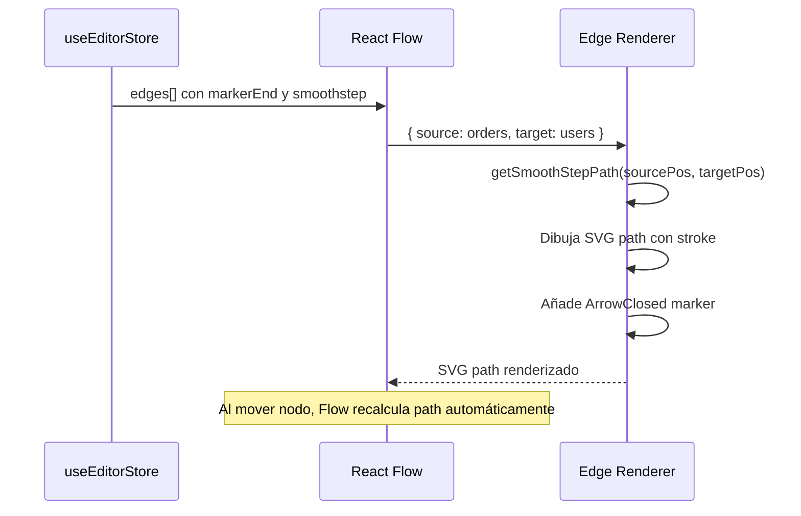

# Issue #11 — Edges de Relaciones FK con Cardinalidad

**Milestone:** v0.2 — Canvas + Editor
**Branch:** `feat/issue-11-custom-edges`
**Depende de:** Issue #10 ✅
**Estado:** ⬜ Pendiente

---

## Historia de Usuario

Como diseñador de esquemas relacionales, quiero que las FKs se representen como líneas con cardinalidad 1:N para identificar rápidamente las dependencias entre entidades.

---

## Criterios de Aceptación

- [ ] Edges del parser generan objetos edge válidos para React Flow
- [ ] Línea tipo `smoothstep` o Bezier
- [ ] `markerEnd` con flecha apuntando a la tabla referenciada
- [ ] Edges se recalculan automáticamente al mover nodos

---

## Arquitectura

### Estructura de archivos

```
components/editor/
├── Canvas.tsx                    ← registrar edgeTypes aquí
└── edges/
    └── RelationshipEdge.tsx      ← NUEVO — edge personalizado (opcional)
```

### Por qué los edges de React Flow se recalculan solos

React Flow recalcula la ruta de cada edge automáticamente cuando cambia la posición de los nodos fuente o destino. No hay que hacer nada explícito — solo asegurarse de que `source` y `target` coincidan con los `id` de los nodos.

---

## Patrones y Reglas

### Estructura de un edge válido para este proyecto

```typescript
// Formato que debe salir del parser (ya definido en @fluxsql/parsers)
const edge: FlowEdge = {
  id: "fk-orders-users",
  source: "orders",           // id del nodo con la FK
  target: "users",            // id del nodo referenciado
  sourceHandle: "user_id-source",   // handle de la columna FK
  targetHandle: "id-target",        // handle de la columna PK destino
  type: "smoothstep",
  animated: false,
  style: { stroke: "#00D4FF", strokeWidth: 1.5 },
  markerEnd: {
    type: MarkerType.ArrowClosed,
    width: 16,
    height: 16,
    color: "#00D4FF",
  },
}
```

### Importar MarkerType en Canvas.tsx

```tsx
import { MarkerType } from "@xyflow/react"
```

### Configurar edges en el store — el parser ya los genera en este formato

Los edges ya vienen del parser con `type: "smoothstep"` y `style: { stroke: "#00D4FF" }`. Solo hay que asegurarse de añadir `markerEnd` al transformar los edges del parser al store:

```typescript
// store/useEditorStore.ts — función helper
import { MarkerType } from "@xyflow/react"
import type { FlowEdge } from "@fluxsql/parsers"
import type { Edge } from "@xyflow/react"

export function toReactFlowEdge(edge: FlowEdge): Edge {
  return {
    ...edge,
    markerEnd: {
      type: MarkerType.ArrowClosed,
      width: 16,
      height: 16,
      color: "#00D4FF",
    },
  }
}
```

### Edge personalizado (opcional para esta issue)

Si se quiere mostrar una etiqueta con "1:N" en la línea:

```tsx
// components/editor/edges/RelationshipEdge.tsx
"use client"
import { BaseEdge, EdgeLabelRenderer, getSmoothStepPath } from "@xyflow/react"
import type { EdgeProps } from "@xyflow/react"

export function RelationshipEdge({
  sourceX, sourceY, targetX, targetY,
  sourcePosition, targetPosition,
  style, markerEnd,
}: EdgeProps) {
  const [edgePath, labelX, labelY] = getSmoothStepPath({
    sourceX, sourceY, sourcePosition,
    targetX, targetY, targetPosition,
  })

  return (
    <>
      <BaseEdge path={edgePath} markerEnd={markerEnd} style={style} />
      <EdgeLabelRenderer>
        <div
          className="absolute text-[10px] text-[#00D4FF] bg-[#0A0F1E] px-1 rounded pointer-events-none"
          style={{ transform: `translate(-50%, -50%) translate(${labelX}px,${labelY}px)` }}
        >
          N
        </div>
      </EdgeLabelRenderer>
    </>
  )
}
```

---

## Errores Comunes y Cómo Evitarlos

| Error | Causa | Solución |
|---|---|---|
| Flecha no aparece | `markerEnd` no configurado en el edge | Usar `toReactFlowEdge()` al cargar edges en el store |
| Edge no conecta | `sourceHandle` o `targetHandle` no coincide con el `id` del Handle en el nodo | El id del Handle en `TableNode` debe ser `{col.name}-source` / `{col.name}-target` |
| Línea recta en vez de curva | `type` no es `smoothstep` | Verificar que el edge tiene `type: "smoothstep"` |
| Edge desaparece al mover nodo | `source`/`target` no coinciden con el `id` del nodo | El `id` del nodo debe ser el nombre de la tabla en minúsculas, igual que en el parser |

---

## Verificación Final

```typescript
// Datos de prueba — 2 nodos + 1 edge
const testNodes = [
  { id: "users", type: "tableNode", position: { x: 50, y: 100 },
    data: { tableName: "users", columns: [{ name: "id", type: "UUID", isPrimaryKey: true, isForeignKey: false }] }},
  { id: "orders", type: "tableNode", position: { x: 400, y: 100 },
    data: { tableName: "orders", columns: [
      { name: "id", type: "UUID", isPrimaryKey: true, isForeignKey: false },
      { name: "user_id", type: "UUID", isPrimaryKey: false, isForeignKey: true }
    ]}}
]

const testEdges = [
  toReactFlowEdge({
    id: "fk-orders-users",
    source: "orders", target: "users",
    sourceHandle: "user_id-source", targetHandle: "id-target",
    type: "smoothstep", animated: false,
    style: { stroke: "#00D4FF" }
  })
]
```

- Línea cian de `orders` → `users`
- Flecha cerrada (▶) en el extremo de `users`
- Al mover `orders`, la línea se recalcula sola

```bash
pnpm build  # Sin errores
```

---

## Diagrama de Secuencia


