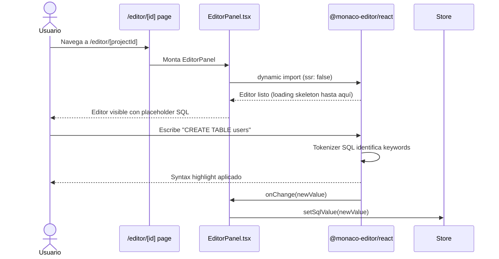

# Issue #12 — Monaco Editor con Syntax Highlighting SQL

**Milestone:** v0.2 — Canvas + Editor
**Branch:** `feat/issue-12-monaco-editor`
**Depende de:** Issue #9 ✅
**Estado:** ⬜ Pendiente

---

## Historia de Usuario

Como desarrollador backend, quiero un editor de código con syntax highlighting SQL, autocompletado y numeración de líneas para escribir DDL sin errores tipográficos.

---

## Criterios de Aceptación

- [ ] `@monaco-editor/react` integrado en Next.js
- [ ] Lenguaje `sql` configurado por defecto
- [ ] Minimap desactivado
- [ ] Tema `vs-dark` en dark mode, `vs` en light mode
- [ ] El valor del editor se sincroniza con el store (preparado para Issue #13)

---

## Arquitectura

### Estructura de archivos

```
components/editor/
├── EditorPanel.tsx               ← NUEVO — wrapper del Monaco Editor
├── Canvas.tsx                    ← ya existe
└── index.ts                      ← actualizar exports
```

### Por qué `@monaco-editor/react` y no el Monaco vanilla

`@monaco-editor/react` maneja automáticamente:
- La carga lazy del bundle de Monaco (~2MB) sin bloquear el render
- El `worker` de Monaco en Next.js (evita errores de `self is not defined`)
- La limpieza del editor en el `unmount`

Sin este wrapper, Monaco en Next.js requiere configuración manual de workers que es compleja y frágil.

### Por qué el editor debe ser `dynamic` con `ssr: false`

Monaco usa APIs del browser (`window`, `document`, `worker`). Si Next.js intenta renderizarlo en el servidor, falla. Obligatorio usar:

```typescript
import dynamic from "next/dynamic"

const MonacoEditor = dynamic(
  () => import("@monaco-editor/react"),
  { ssr: false, loading: () => <EditorSkeleton /> }
)
```

---

## Patrones y Reglas

### Componente EditorPanel completo

```tsx
// components/editor/EditorPanel.tsx
"use client"
import dynamic from "next/dynamic"
import { useEditorStore } from "@/store/useEditorStore"

// CRÍTICO: ssr: false — Monaco usa APIs del browser
const MonacoEditor = dynamic(
  () => import("@monaco-editor/react"),
  {
    ssr: false,
    loading: () => (
      <div className="w-full h-full bg-[#1E1E1E] animate-pulse flex items-center justify-center">
        <span className="text-[#6B7280] text-sm">Cargando editor...</span>
      </div>
    ),
  }
)

const SQL_PLACEHOLDER = `-- FluxSQL Editor
-- Escribe tu DDL de PostgreSQL aquí

CREATE TABLE users (
  id UUID PRIMARY KEY DEFAULT gen_random_uuid(),
  email TEXT NOT NULL UNIQUE,
  created_at TIMESTAMPTZ DEFAULT NOW()
);
`

export function EditorPanel() {
  const { sqlValue, setSqlValue } = useEditorStore()

  return (
    <div className="w-full h-full flex flex-col bg-[#1E1E1E]">
      {/* Barra superior del editor */}
      <div className="flex items-center px-4 py-2 bg-[#252526] border-b border-[#1E2A45]">
        <span className="text-[#9CDCFE] text-xs font-mono">schema.sql</span>
      </div>

      {/* Monaco Editor */}
      <div className="flex-1 overflow-hidden">
        <MonacoEditor
          height="100%"
          language="sql"
          theme="vs-dark"
          value={sqlValue ?? SQL_PLACEHOLDER}
          onChange={(value) => setSqlValue(value ?? "")}
          options={{
            minimap: { enabled: false },
            fontSize: 13,
            fontFamily: "'JetBrains Mono', 'Cascadia Code', monospace",
            lineNumbers: "on",
            scrollBeyondLastLine: false,
            wordWrap: "on",
            tabSize: 2,
            renderLineHighlight: "line",
            smoothScrolling: true,
            cursorBlinking: "smooth",
            padding: { top: 16, bottom: 16 },
          }}
        />
      </div>
    </div>
  )
}
```

### Agregar `sqlValue` y `setSqlValue` al store

```typescript
// store/useEditorStore.ts — añadir al store existente
interface EditorStore {
  // ... campos existentes (nodes, edges, etc.)
  sqlValue: string
  setSqlValue: (value: string) => void
}

// En el create():
sqlValue: "",
setSqlValue: (value) => set({ sqlValue: value }),
```

### Instalar dependencia

```bash
pnpm add @monaco-editor/react --filter web
```

### Configurar el split layout en EditorLayout.tsx

```tsx
// components/editor/EditorLayout.tsx
"use client"
import { EditorPanel } from "./EditorPanel"
import { Canvas } from "./Canvas"

export function EditorLayout() {
  return (
    <div className="flex h-full w-full overflow-hidden">
      {/* Panel izquierdo — Monaco */}
      <div className="w-[40%] min-w-[300px] h-full border-r border-[#1E2A45]">
        <EditorPanel />
      </div>

      {/* Panel derecho — Canvas React Flow */}
      <div className="flex-1 h-full bg-[#0A0F1E]">
        <Canvas />
      </div>
    </div>
  )
}
```

---

## Errores Comunes y Cómo Evitarlos

| Error | Causa | Solución |
|---|---|---|
| `self is not defined` en SSR | Monaco sin `ssr: false` | Siempre importar con `dynamic(() => import(...), { ssr: false })` |
| Editor sin altura | Padre sin `height` explícito | El div padre debe tener `h-full` y su ancestro `h-screen` |
| `onChange` se dispara con `undefined` | El editor puede emitir undefined al inicializar | Usar `value ?? ""` en el handler |
| Fuente monospace no carga | `fontFamily` no disponible | La fuente en `options.fontFamily` es solo una preferencia — Monaco usa el fallback automáticamente |
| Monaco carga 2 veces | Importar `@monaco-editor/react` en múltiples archivos | Un solo `dynamic` import en `EditorPanel.tsx`, los otros archivos solo importan `EditorPanel` |

---

## Verificación Final

1. Ir a `/editor/[projectId]`
2. Ver el panel izquierdo con el editor cargado (el skeleton de "Cargando editor..." aparece brevemente)
3. El placeholder SQL aparece con syntax highlighting (palabras clave en azul/morado)
4. Escribir `CREATE TABLE` → se resalta como keyword
5. Verificar que el minimap NO aparece

```bash
pnpm build  # Sin errores — Monaco debe compilar sin warnings
```

---

## Diagrama de Secuencia


