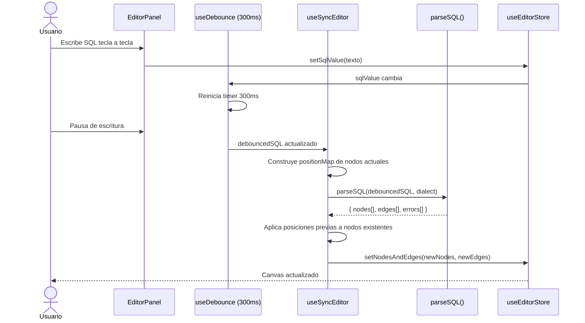

# Issue #13 — Sync Editor ↔ Canvas en Tiempo Real (debounce 300ms)

**Milestone:** v0.2 — Canvas + Editor
**Branch:** `feat/issue-13-realtime-sync`
**Depende de:** Issue #12 ✅, Issue #6 ✅
**Estado:** ⬜ Pendiente

---

## Historia de Usuario

Como usuario de FluxSQL, quiero que el diagrama se genere automáticamente mientras escribo SQL, para recibir feedback visual instantáneo sin presionar ningún botón.

---

## Criterios de Aceptación

- [ ] Custom hook `useDebounce` con retraso de 300ms
- [ ] Al cambiar el valor debounced, ejecutar `parseSQL()` del parser
- [ ] Nodos y edges resultantes actualizan el store de React Flow
- [ ] Posiciones previas de nodos existentes se conservan — solo los nuevos se auto-posicionan

---

## Arquitectura

### Estructura de archivos

```
apps/web/
├── hooks/
│   ├── useDebounce.ts        ← NUEVO — hook genérico de debounce
│   └── useSyncEditor.ts      ← NUEVO — orquesta parser + store
└── components/editor/
    └── EditorPanel.tsx       ← MODIFICAR — usar useSyncEditor
```

### Por qué dos hooks separados y no uno solo

- `useDebounce` es genérico y reutilizable (puede usarse en búsquedas, filtros, etc.)
- `useSyncEditor` contiene la lógica específica del editor: llama al parser, preserva posiciones, actualiza el store
- Separados son más fáciles de testear y de entender

### Por qué preservar posiciones es crítico

Si el usuario reorganizó manualmente los nodos en el canvas y luego corrige un typo en el SQL, el diagrama no debe resetear todas las posiciones. Solo los nodos **nuevos** (que no existían antes) reciben posición del layout automático.

---

## Patrones y Reglas

### Hook useDebounce

```typescript
// hooks/useDebounce.ts
import { useState, useEffect } from "react"

export function useDebounce<T>(value: T, delay: number = 300): T {
  const [debouncedValue, setDebouncedValue] = useState<T>(value)

  useEffect(() => {
    const timer = setTimeout(() => {
      setDebouncedValue(value)
    }, delay)

    return () => clearTimeout(timer)  // Limpia el timer si value cambia antes de delay
  }, [value, delay])

  return debouncedValue
}
```

### Hook useSyncEditor — la lógica central

```typescript
// hooks/useSyncEditor.ts
"use client"
import { useEffect } from "react"
import { useDebounce } from "./useDebounce"
import { parseSQL } from "@fluxsql/parsers"
import { useEditorStore } from "@/store/useEditorStore"
import { toReactFlowEdge } from "@/store/useEditorStore"
import type { Node } from "@xyflow/react"

export function useSyncEditor(dialect: 'postgresql' | 'mysql' | 'sqlserver' = 'postgresql') {
  const { sqlValue, nodes: currentNodes, setNodesAndEdges } = useEditorStore()
  const debouncedSQL = useDebounce(sqlValue, 300)

  useEffect(() => {
    if (!debouncedSQL.trim()) return

    const result = parseSQL(debouncedSQL, dialect)
    if (result.errors.length > 0 && result.nodes.length === 0) return  // SQL inválido — no actualizar

    // Preservar posiciones de nodos existentes
    const positionMap = new Map<string, { x: number; y: number }>()
    currentNodes.forEach((node) => {
      positionMap.set(node.id, node.position)
    })

    const newNodes: Node[] = result.nodes.map((parserNode) => ({
      ...parserNode,
      // Si el nodo ya existía, usar su posición actual; si es nuevo, usar la del layout
      position: positionMap.get(parserNode.id) ?? parserNode.position,
    }))

    const newEdges = result.edges.map(toReactFlowEdge)

    setNodesAndEdges(newNodes, newEdges)
  }, [debouncedSQL, dialect])  // Solo re-ejecutar cuando cambie el SQL debounced
}
```

### Integrar en EditorPanel.tsx

```tsx
// components/editor/EditorPanel.tsx — añadir al componente existente
import { useSyncEditor } from "@/hooks/useSyncEditor"

export function EditorPanel() {
  const { sqlValue, setSqlValue } = useEditorStore()
  useSyncEditor('postgresql')  // Activa el sync automático

  // ... resto del componente igual
}
```

---

## Regla de preservación de posiciones — detalle

```
Estado actual del canvas:
  nodo "users"    → position: { x: 350, y: 120 }  (movido manualmente)
  nodo "projects" → position: { x: 80, y: 80 }   (movido manualmente)

Usuario añade "CREATE TABLE payments (...)" al SQL

Resultado esperado:
  nodo "users"    → position: { x: 350, y: 120 }  ✅ conservado
  nodo "projects" → position: { x: 80, y: 80 }   ✅ conservado
  nodo "payments" → position: { x: 640, y: 80 }  ← del layout automático
```

La clave es el `positionMap` que se construye ANTES de llamar al parser.

---

## Errores Comunes y Cómo Evitarlos

| Error | Causa | Solución |
|---|---|---|
| Parser se ejecuta en cada tecla | `useEffect` depende de `sqlValue` directo, no del debounced | Asegurarse de que el `useEffect` depende de `debouncedSQL`, no de `sqlValue` |
| Posiciones se resetean al editar | `positionMap` construido después de `setNodesAndEdges` | Construir `positionMap` ANTES de llamar al parser |
| Canvas se borra con SQL inválido | `result.nodes.length === 0` sin verificar errores | Si hay errores y cero nodos, retornar sin actualizar el store |
| `parseSQL` no encontrado | Import desde ruta incorrecta | Usar `import { parseSQL } from "@fluxsql/parsers"` — el alias del monorepo |
| Dependencia `currentNodes` en el useEffect | Causa loop infinito | `currentNodes` NO va en el array de dependencias del useEffect — solo `debouncedSQL` |

---

## Verificación Final

1. Ir a `/editor/[projectId]`
2. En Monaco Editor, borrar el placeholder y escribir:
```sql
CREATE TABLE clientes (
  id UUID PRIMARY KEY,
  nombre TEXT NOT NULL
);
```
3. Pausar 300ms → nodo "clientes" aparece en el canvas ✅
4. Añadir:
```sql
CREATE TABLE pedidos (
  id UUID PRIMARY KEY,
  cliente_id UUID REFERENCES clientes(id)
);
```
5. Pausar 300ms → nodo "pedidos" + edge hacia "clientes" aparecen ✅
6. Mover el nodo "clientes" en el canvas
7. Añadir una columna al SQL → "clientes" conserva su posición ✅

```bash
pnpm build  # Sin errores
```

---

## Diagrama de Secuencia


