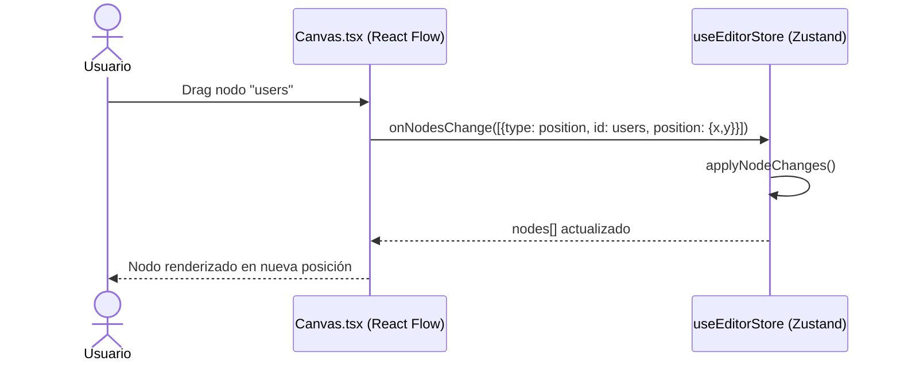

# Issue #9 — Canvas React Flow con Nodos Arrastrables

**Milestone:** v0.2 — Canvas + Editor
**Branch:** `feat/issue-9-react-flow-canvas`
**Depende de:** Issue #5 ✅, Issue #6 ✅
**Estado:** ⬜ Pendiente

---

## Historia de Usuario

Como diseñador de bases de datos, quiero un lienzo interactivo con bloques movibles para organizar visualmente la arquitectura de mis tablas.

---

## Criterios de Aceptación

- [ ] Componente base React Flow ocupa el área principal del editor
- [ ] Nodos arrastrables con drag & drop
- [ ] Controles: zoom in/out, fit view, paneo del lienzo
- [ ] Nodos y edges viven en un store Zustand compartido

---

## Arquitectura

### Estructura de archivos

```
apps/web/
├── app/(protected)/
│   └── editor/
│       └── [projectId]/
│           └── page.tsx           ← Server Component — obtiene el proyecto
├── components/editor/
│   ├── EditorLayout.tsx           ← "use client" — layout splitpane
│   ├── Canvas.tsx                 ← "use client" — React Flow wrapper
│   └── index.ts                   ← barrel export
└── store/
    └── useEditorStore.ts          ← Zustand store de nodes/edges
```

### Por qué Zustand y no useState local

El estado de nodos y edges necesita ser compartido entre:
- `Canvas.tsx` (los renderiza)
- `EditorPanel.tsx` (Issue #12, actualiza cuando cambia el SQL)
- `Toolbar.tsx` (botón fit view, botón export)

Con `useState` local habría prop drilling de 3+ niveles. Zustand lo resuelve limpiamente.

### Ruta del editor

```
/editor/[projectId]
```

El `projectId` viene de la URL. El Server Component verifica que el usuario tenga acceso al proyecto antes de renderizar el editor.

---

## Patrones y Reglas

### React Flow — configuración base obligatoria

```tsx
// components/editor/Canvas.tsx
"use client"
import { ReactFlow, Background, Controls, MiniMap, useNodesState, useEdgesState } from "@xyflow/react"
import "@xyflow/react/dist/style.css"

// CRÍTICO: nodeTypes debe definirse FUERA del componente
// Si se define dentro, React Flow recrea los nodos en cada render
const nodeTypes = {
  tableNode: TableNode,  // se añade en Issue #10
}

export function Canvas() {
  const { nodes, edges, onNodesChange, onEdgesChange } = useEditorStore()

  return (
    <div className="w-full h-full">
      <ReactFlow
        nodes={nodes}
        edges={edges}
        onNodesChange={onNodesChange}
        onEdgesChange={onEdgesChange}
        nodeTypes={nodeTypes}
        fitView
        deleteKeyCode={null}  // No borrar nodos con Delete — el parser es la fuente de verdad
      >
        <Background variant="dots" gap={16} size={1} color="#1E2A45" />
        <Controls />
      </ReactFlow>
    </div>
  )
}
```

### Zustand store — estructura base

```typescript
// store/useEditorStore.ts
import { create } from "zustand"
import { applyNodeChanges, applyEdgeChanges } from "@xyflow/react"
import type { Node, Edge, NodeChange, EdgeChange } from "@xyflow/react"

interface EditorStore {
  nodes: Node[]
  edges: Edge[]
  onNodesChange: (changes: NodeChange[]) => void
  onEdgesChange: (changes: EdgeChange[]) => void
  setNodesAndEdges: (nodes: Node[], edges: Edge[]) => void
}

export const useEditorStore = create<EditorStore>((set) => ({
  nodes: [],
  edges: [],
  onNodesChange: (changes) =>
    set((state) => ({ nodes: applyNodeChanges(changes, state.nodes) })),
  onEdgesChange: (changes) =>
    set((state) => ({ edges: applyEdgeChanges(changes, state.edges) })),
  setNodesAndEdges: (nodes, edges) => set({ nodes, edges }),
}))
```

### Layout del editor — split pane

```
┌─────────────────────────────────────────┐
│  Header (nombre proyecto + botones)      │
├──────────────────┬──────────────────────┤
│                  │                      │
│  Monaco Editor   │   React Flow Canvas  │
│  (40% ancho)     │   (60% ancho)        │
│                  │                      │
└──────────────────┴──────────────────────┘
```

Usar CSS Grid con `grid-cols-[40%_60%]` — sin librerías de split pane externas.

### Instalar dependencias

```bash
pnpm add @xyflow/react zustand --filter web
```

**Importante:** El paquete se llama `@xyflow/react` (no `reactflow`). React Flow cambió de nombre en v12.

---

## Estado inicial del canvas para probar

Para que el canvas no aparezca vacío en la Issue #9 (antes de conectar el parser en Issue #13), inicializar con nodos de ejemplo:

```typescript
const DEMO_NODES: Node[] = [
  {
    id: "users",
    type: "tableNode",
    position: { x: 100, y: 100 },
    data: { tableName: "users", columns: [] },
  },
  {
    id: "projects",
    type: "tableNode",
    position: { x: 450, y: 100 },
    data: { tableName: "projects", columns: [] },
  },
]
```

Los nodos de demo se reemplazan en Issue #13 cuando el parser empieza a alimentar el store.

---

## Errores Comunes y Cómo Evitarlos

| Error | Causa | Solución |
|---|---|---|
| Nodos se recrean en cada render | `nodeTypes` definido dentro del componente | Definir `nodeTypes` fuera del componente, a nivel de módulo |
| Canvas no tiene altura | `<div>` padre sin height definido | El padre debe tener `h-screen` o `h-full` con un padre explícito |
| `@xyflow/react/dist/style.css` no importado | Sin el CSS, los controles y handles no se ven | Importar el CSS en el componente o en `layout.tsx` |
| `deleteKeyCode` no configurado | Usuario borra nodos con Delete y el parser no se entera | Siempre `deleteKeyCode={null}` — el parser es la única fuente de verdad |
| Nodo importado de `reactflow` | Paquete deprecado | Usar siempre `@xyflow/react` |

---

## Verificación Final

1. Ir a `/editor/[id-de-un-proyecto-existente]`
2. Ver dos nodos en el canvas
3. Arrastrar un nodo → debe moverse y quedarse en la nueva posición
4. Usar scroll del mouse → debe hacer zoom
5. Clic en el botón ⊡ (fit view) → debe centrar los nodos

```bash
pnpm build  # Sin errores TypeScript
```

---

## Diagrama de Secuencia


