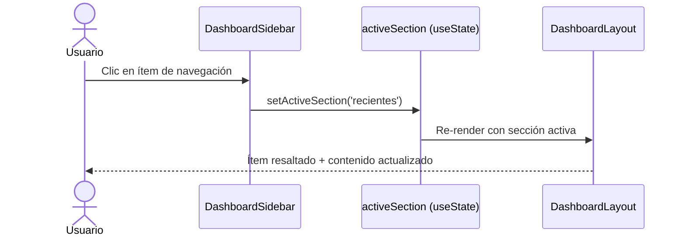

# Issue #41 — Dashboard: Sidebar de Navegación

**Milestone:** v0.5 — Dashboard Redesign
**Branch:** `feat/issue-41-dashboard-sidebar`
**Responsable:** Jefferson
**Labels:** `feature`, `ui`
**Estado:** ⬜ Pendiente

---

## Historia de Usuario

Como usuario autenticado en DBCanvas,
Quiero tener una barra lateral de navegación con accesos directos a mis secciones,
Para orientarme rápidamente dentro de la aplicación sin depender del header superior.

## Criterios de Aceptación

- [ ] Existe un sidebar fijo de 220px en el lado izquierdo del dashboard `task`
- [ ] El sidebar muestra: Logo, Proyectos, Recientes, Compartidos, Papelera, Historial `task`
- [ ] El sidebar muestra el avatar con iniciales y nombre del usuario en la parte inferior `task`
- [ ] En mobile (< 1024px) el sidebar se oculta y el layout ocupa el 100% `task`
- [ ] El item activo tiene fondo `#1E2A45` y texto blanco `task`

## Escenarios Gherkin

```gherkin
Escenario: Navegación desde el sidebar
  DADO que el usuario está en el dashboard con el sidebar visible
  CUANDO hace clic en "Recientes"
  ENTONCES el item "Recientes" queda visualmente activo
  Y el contenido principal refleja la sección seleccionada

Escenario: Sidebar oculto en mobile
  DADO que el usuario abre el dashboard en un dispositivo de 768px
  CUANDO carga la página
  ENTONCES el sidebar no es visible
  Y el contenido ocupa el 100% del ancho
```

## Diagrama de Secuencia



---

## Contexto de Implementación

### Leer primero
- `apps/web/app/(protected)/dashboard/page.tsx`
- `apps/web/app/(protected)/layout.tsx`
- `apps/web/lib/db/schema.ts` — campos de `users` (name, avatar_url)

### Archivos a crear/modificar
```
apps/web/
├── components/dashboard/
│   └── DashboardSidebar.tsx    ← NUEVO ("use client")
└── app/(protected)/dashboard/
    └── page.tsx                ← MODIFICAR — añadir sidebar al layout
```

### Estructura visual del sidebar

```
┌──────────────────────┐
│  🔷 DBCanvas         │  ← Logo
├──────────────────────┤
│  🏠 Proyectos  ←activo│
│  🕐 Recientes        │
│  👥 Compartidos      │
│  🗑️  Papelera         │
│  📋 Historial        │
├──────────────────────┤
│  [EP] Emanuel P.     │  ← Avatar iniciales + nombre
│       Salir →        │
└──────────────────────┘
```

### Colores

| Elemento | Valor |
|---|---|
| Fondo sidebar | `#0D1117` |
| Borde derecho | `1px solid #1E2A45` |
| Ítem activo bg | `#1E2A45` |
| Ítem activo text | `#FFFFFF` |
| Ítem inactivo text | `#6B7280` |
| Avatar bg | generado desde nombre (hash) |
| Ancho | `220px` fijo |

### Componente DashboardSidebar.tsx

```tsx
'use client'
import Link from 'next/link'
import { usePathname } from 'next/navigation'
import { Home, Clock, Users, Trash2, History, LogOut } from 'lucide-react'

const NAV_ITEMS = [
  { icon: Home,    label: 'Proyectos',   href: '/dashboard' },
  { icon: Clock,   label: 'Recientes',   href: '/dashboard?section=recientes' },
  { icon: Users,   label: 'Compartidos', href: '/dashboard?section=compartidos' },
  { icon: Trash2,  label: 'Papelera',    href: '/dashboard?section=papelera' },
  { icon: History, label: 'Historial',   href: '/dashboard?section=historial' },
]

function getInitials(name: string) {
  return name.split(' ').map(n => n[0]).join('').toUpperCase().slice(0, 2)
}

function getAvatarColor(name: string) {
  const colors = ['#1A6CF6','#10B981','#8B5CF6','#F59E0B','#EF4444','#06B6D4']
  let hash = 0
  for (let i = 0; i < name.length; i++) hash = ((hash << 5) - hash + name.charCodeAt(i)) | 0
  return colors[Math.abs(hash) % colors.length]
}

export function DashboardSidebar({ userName }: { userName: string }) {
  const pathname = usePathname()

  return (
    <aside className="hidden lg:flex flex-col w-[220px] flex-shrink-0 h-screen sticky top-0"
           style={{ backgroundColor: '#0D1117', borderRight: '1px solid #1E2A45' }}>
      {/* Logo */}
      <div className="flex items-center gap-2 px-4 py-5" style={{ borderBottom: '1px solid #1E2A45' }}>
        <div className="w-7 h-7 bg-[#1A6CF6] rounded-lg flex items-center justify-center flex-shrink-0">
          <span className="text-white text-xs font-bold">DB</span>
        </div>
        <span className="text-white font-semibold">DBCanvas</span>
      </div>

      {/* Nav items */}
      <nav className="flex-1 px-2 py-4 flex flex-col gap-1">
        {NAV_ITEMS.map(({ icon: Icon, label, href }) => {
          const isActive = pathname === href || (href === '/dashboard' && pathname === '/dashboard')
          return (
            <Link key={label} href={href}
              className="flex items-center gap-3 px-3 py-2 rounded-lg text-sm transition-colors"
              style={{
                backgroundColor: isActive ? '#1E2A45' : 'transparent',
                color: isActive ? '#FFFFFF' : '#6B7280',
              }}>
              <Icon size={16} />
              {label}
            </Link>
          )
        })}
      </nav>

      {/* Usuario */}
      <div className="px-3 py-4" style={{ borderTop: '1px solid #1E2A45' }}>
        <div className="flex items-center gap-2 mb-3">
          <div className="w-8 h-8 rounded-full flex items-center justify-center flex-shrink-0 text-white text-xs font-bold"
               style={{ backgroundColor: getAvatarColor(userName) }}>
            {getInitials(userName)}
          </div>
          <span className="text-sm text-white truncate">{userName}</span>
        </div>
        <form action="/auth/signout" method="POST">
          <button type="submit"
            className="flex items-center gap-2 text-xs w-full px-2 py-1.5 rounded-lg transition-colors"
            style={{ color: '#6B7280' }}>
            <LogOut size={14} />
            Salir
          </button>
        </form>
      </div>
    </aside>
  )
}
```

### Modificar dashboard/page.tsx

```tsx
// Envolver el contenido con un flex row:
<div className="flex min-h-screen">
  <DashboardSidebar userName={dbUser.name ?? 'Usuario'} />
  <main className="flex-1 overflow-auto">
    {/* contenido existente del dashboard */}
  </main>
</div>
```

---

## Verificación Final

- `pnpm build` → sin errores ✅
- Desktop → sidebar visible a la izquierda ✅
- Mobile 768px → sidebar oculto, contenido al 100% ✅
- Ítem "Proyectos" activo al estar en /dashboard ✅
- Avatar con iniciales y nombre del usuario en la parte inferior ✅
- Actualizar `.ia/PROGRESS.md` marcando Issue #41 como ✅
- `git add . && git commit -m "feat: dashboard sidebar de navegación (#41)"`
