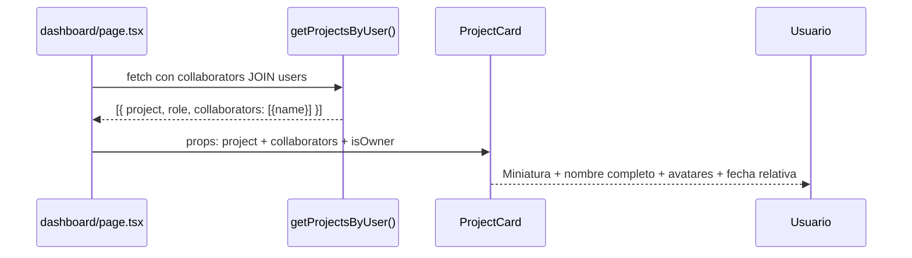

# Issue #42 — Dashboard: Cards Enriquecidas con Colaboradores y Fechas

**Milestone:** v0.5 — Dashboard Redesign
**Branch:** `feat/issue-42-dashboard-cards-v2`
**Responsable:** Jefferson
**Labels:** `feature`, `ui`
**Estado:** ⬜ Pendiente

---

## Historia de Usuario

Como usuario del dashboard,
Quiero ver en cada tarjeta de proyecto los avatares de colaboradores, la fecha relativa y una card para crear proyectos,
Para entender de un vistazo quién colabora y cuándo fue modificado cada proyecto.

## Criterios de Aceptación

- [ ] Cada card muestra avatares apilados de colaboradores (máx 3 + badge "+N") `task`
- [ ] La fecha muestra formato relativo: "hoy", "ayer", "hace 3 días", "hace 2 sem" `task`
- [ ] Existe una card final "Crear nuevo proyecto" con ícono + que abre el modal existente `task`
- [ ] El nombre del proyecto se muestra completo (sin truncar a "Ve...") `task`
- [ ] El ícono del proyecto en la miniatura es un hexágono con el color del gradiente, no el emoji ⬡ `task`

## Escenarios Gherkin

```gherkin
Escenario: Ver colaboradores en una card
  DADO que un proyecto tiene 4 colaboradores
  CUANDO el usuario ve la card en el dashboard
  ENTONCES aparecen 3 avatares apilados con iniciales
  Y un badge "+1" indica el colaborador adicional

Escenario: Card de creación de proyecto
  DADO que el usuario está en el dashboard
  CUANDO ve la última card del grid
  ENTONCES aparece una card con borde punteado e ícono "+"
  Y al hacer clic abre el modal de crear proyecto existente
```

## Diagrama de Secuencia



---

## Contexto de Implementación

### Leer primero
- `apps/web/components/dashboard/ProjectCard.tsx` — estado actual
- `apps/web/components/dashboard/ProjectGrid.tsx` — cómo se pasan los datos
- `apps/web/lib/db/queries/projects.ts` (o donde esté `getProjectsByUser`) — ver el SELECT actual

### Archivos a modificar
```
apps/web/
├── components/dashboard/
│   ├── ProjectCard.tsx     ← MODIFICAR — avatares, fecha relativa, nombre completo
│   └── ProjectGrid.tsx     ← MODIFICAR — añadir CreateProjectCard al final
└── lib/db/queries/
    └── projects.ts         ← MODIFICAR — incluir collaborators en el SELECT
```

### Función de fecha relativa (añadir en ProjectCard.tsx)

```tsx
function getRelativeDate(date: Date | string): string {
  const now = new Date()
  const d = new Date(date)
  const diffMs = now.getTime() - d.getTime()
  const diffDays = Math.floor(diffMs / (1000 * 60 * 60 * 24))

  if (diffDays === 0) return 'hoy'
  if (diffDays === 1) return 'ayer'
  if (diffDays < 7) return `hace ${diffDays} días`
  if (diffDays < 14) return 'hace 1 semana'
  if (diffDays < 30) return `hace ${Math.floor(diffDays / 7)} semanas`
  if (diffDays < 60) return 'hace 1 mes'
  return `hace ${Math.floor(diffDays / 30)} meses`
}
```

### Componente de avatares apilados

```tsx
function CollaboratorAvatars({ collaborators }: { collaborators: { name: string }[] }) {
  const MAX_VISIBLE = 3
  const visible = collaborators.slice(0, MAX_VISIBLE)
  const extra = collaborators.length - MAX_VISIBLE

  const colors = ['#1A6CF6','#10B981','#8B5CF6','#F59E0B','#EF4444']
  function getColor(name: string) {
    let h = 0
    for (let i = 0; i < name.length; i++) h = ((h << 5) - h + name.charCodeAt(i)) | 0
    return colors[Math.abs(h) % colors.length]
  }
  function getInitials(name: string) {
    return name.split(' ').map(n => n[0]).join('').toUpperCase().slice(0, 2)
  }

  return (
    <div className="flex items-center">
      {visible.map((c, i) => (
        <div key={i}
          className="w-6 h-6 rounded-full flex items-center justify-center text-white text-[9px] font-bold border-2"
          style={{
            backgroundColor: getColor(c.name),
            borderColor: '#0D1117',
            marginLeft: i === 0 ? 0 : '-6px',
            zIndex: MAX_VISIBLE - i,
          }}>
          {getInitials(c.name)}
        </div>
      ))}
      {extra > 0 && (
        <div className="w-6 h-6 rounded-full flex items-center justify-center text-[9px] font-bold border-2"
          style={{ backgroundColor: '#1E2A45', borderColor: '#0D1117', marginLeft: '-6px', color: '#9CA3AF' }}>
          +{extra}
        </div>
      )}
    </div>
  )
}
```

### CreateProjectCard (añadir en ProjectGrid.tsx)

```tsx
// Al final del grid, después del map de proyectos:
<button
  onClick={onCreateProject}  // ← el mismo handler que ya usa el botón "Crear Proyecto"
  className="rounded-xl border-2 border-dashed transition-all duration-200 hover:border-[#1A6CF6] group"
  style={{ borderColor: '#1E2A45', minHeight: '200px' }}>
  <div className="h-full flex flex-col items-center justify-center gap-3 p-6">
    <div className="w-12 h-12 rounded-full flex items-center justify-center transition-colors"
         style={{ backgroundColor: '#1E2A45' }}>
      <span className="text-2xl text-[#6B7280] group-hover:text-[#1A6CF6] transition-colors">+</span>
    </div>
    <div className="text-center">
      <p className="text-white text-sm font-medium">Crear nuevo proyecto</p>
      <p className="text-xs mt-1" style={{ color: '#6B7280' }}>Comienza desde cero</p>
    </div>
  </div>
</button>
```

---

## Verificación Final

- `pnpm build` → sin errores ✅
- Cards muestran nombre completo sin truncar ✅
- Cards con colaboradores muestran avatares apilados ✅
- Fecha relativa visible en cada card ✅
- Última card es "Crear nuevo proyecto" ✅
- Actualizar `.ia/PROGRESS.md` marcando Issue #42 como ✅
- `git add . && git commit -m "feat: dashboard cards con colaboradores y fechas relativas (#42)"`
