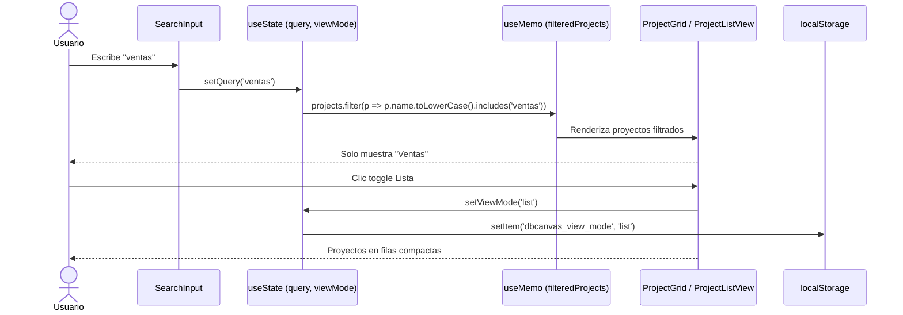

# Issue #43 — Dashboard: Búsqueda y Toggle Grid/Lista

**Milestone:** v0.5 — Dashboard Redesign
**Branch:** `feat/issue-43-dashboard-search-toggle`
**Responsable:** Jefferson
**Labels:** `feature`, `ui`
**Estado:** ⬜ Pendiente

---

## Historia de Usuario

Como usuario con múltiples proyectos,
Quiero poder buscar proyectos por nombre y cambiar entre vista de grilla y lista,
Para encontrar rápidamente lo que necesito y visualizar la información de la forma que más me convenga.

## Criterios de Aceptación

- [ ] Campo de búsqueda que filtra proyectos por nombre en tiempo real (client-side) `task`
- [ ] Toggle con íconos Grid y List para cambiar la vista `task`
- [ ] Vista lista: filas compactas con nombre, descripción, colaboradores y fecha `task`
- [ ] Preferencia de vista persiste en localStorage (`dbcanvas_view_mode`) `task`
- [ ] Empty state "Sin resultados para [query]" cuando la búsqueda no encuentra nada `task`

## Escenarios Gherkin

```gherkin
Escenario: Búsqueda en tiempo real
  DADO que el usuario tiene 5 proyectos en el dashboard
  CUANDO escribe "ventas" en el campo de búsqueda
  ENTONCES solo se muestran proyectos cuyo nombre contiene "ventas"
  Y la búsqueda ocurre sin recargar la página

Escenario: Cambio de vista a lista
  DADO que el dashboard está en vista grilla
  CUANDO el usuario hace clic en el ícono de lista
  ENTONCES los proyectos se muestran como filas horizontales compactas
  Y al recargar la página, la vista lista se mantiene

Escenario: Sin resultados
  DADO que no existe ningún proyecto con el nombre buscado
  CUANDO el usuario escribe "xyz123"
  ENTONCES aparece un empty state con el mensaje
  "Sin resultados para 'xyz123'"
  Y un botón para limpiar la búsqueda
```

## Diagrama de Secuencia



---

## Contexto de Implementación

### Leer primero
- `apps/web/app/(protected)/dashboard/page.tsx`
- `apps/web/components/dashboard/ProjectGrid.tsx`

### Archivos a crear/modificar
```
apps/web/
├── components/dashboard/
│   ├── DashboardToolbar.tsx    ← NUEVO — búsqueda + toggle
│   ├── ProjectListView.tsx     ← NUEVO — vista lista
│   └── ProjectGrid.tsx         ← sin cambios (ya existe)
└── app/(protected)/dashboard/
    └── page.tsx                ← MODIFICAR — pasar proyectos al client component
```

### DashboardToolbar.tsx ("use client")

```tsx
'use client'
import { Search, LayoutGrid, List } from 'lucide-react'

export function DashboardToolbar({
  query,
  onQueryChange,
  viewMode,
  onViewModeChange,
}: {
  query: string
  onQueryChange: (q: string) => void
  viewMode: 'grid' | 'list'
  onViewModeChange: (m: 'grid' | 'list') => void
}) {
  return (
    <div className="flex items-center gap-3 mb-6">
      {/* Búsqueda */}
      <div className="relative flex-1 max-w-sm">
        <Search size={15} className="absolute left-3 top-1/2 -translate-y-1/2 text-[#6B7280]" />
        <input
          type="text"
          value={query}
          onChange={e => onQueryChange(e.target.value)}
          placeholder="Buscar proyectos..."
          className="w-full pl-9 pr-4 py-2 rounded-lg text-sm text-white placeholder-[#4B5563] outline-none"
          style={{ backgroundColor: '#111827', border: '1px solid #1E2A45' }}
        />
      </div>

      {/* Toggle grid/lista */}
      <div className="flex items-center rounded-lg overflow-hidden" style={{ border: '1px solid #1E2A45' }}>
        <button
          onClick={() => onViewModeChange('grid')}
          className="p-2 transition-colors"
          style={{ backgroundColor: viewMode === 'grid' ? '#1E2A45' : 'transparent',
                   color: viewMode === 'grid' ? '#FFFFFF' : '#6B7280' }}>
          <LayoutGrid size={16} />
        </button>
        <button
          onClick={() => onViewModeChange('list')}
          className="p-2 transition-colors"
          style={{ backgroundColor: viewMode === 'list' ? '#1E2A45' : 'transparent',
                   color: viewMode === 'list' ? '#FFFFFF' : '#6B7280' }}>
          <List size={16} />
        </button>
      </div>
    </div>
  )
}
```

### ProjectListView.tsx — vista lista compacta

```tsx
// Fila por proyecto, sin miniatura grande:
// [Avatar color] Nombre del proyecto   Descripción truncada   [avatares colabs]   Fecha relativa   [badge rol]
```

### Integración en dashboard/page.tsx o componente cliente

```tsx
// Como page.tsx es Server Component, crear un wrapper client:
// components/dashboard/DashboardClient.tsx ("use client")

'use client'
import { useState, useMemo, useEffect } from 'react'
import { DashboardToolbar } from './DashboardToolbar'
import { ProjectGrid } from './ProjectGrid'
import { ProjectListView } from './ProjectListView'

export function DashboardClient({ projects, currentUserId, onCreateProject }) {
  const [query, setQuery] = useState('')
  const [viewMode, setViewMode] = useState<'grid' | 'list'>('grid')

  // Cargar preferencia guardada
  useEffect(() => {
    const saved = localStorage.getItem('dbcanvas_view_mode')
    if (saved === 'grid' || saved === 'list') setViewMode(saved)
  }, [])

  // Guardar preferencia al cambiar
  function handleViewModeChange(mode: 'grid' | 'list') {
    setViewMode(mode)
    localStorage.setItem('dbcanvas_view_mode', mode)
  }

  const filtered = useMemo(() =>
    projects.filter(p =>
      p.project.name.toLowerCase().includes(query.toLowerCase())
    ), [projects, query])

  return (
    <>
      <DashboardToolbar
        query={query}
        onQueryChange={setQuery}
        viewMode={viewMode}
        onViewModeChange={handleViewModeChange}
      />

      {filtered.length === 0 && query ? (
        <div className="flex flex-col items-center justify-center py-20 text-center">
          <p className="text-white font-medium mb-2">Sin resultados para "{query}"</p>
          <button onClick={() => setQuery('')}
            className="text-sm text-[#1A6CF6] hover:underline">
            Limpiar búsqueda
          </button>
        </div>
      ) : viewMode === 'grid' ? (
        <ProjectGrid projects={filtered} currentUserId={currentUserId} onCreateProject={onCreateProject} />
      ) : (
        <ProjectListView projects={filtered} currentUserId={currentUserId} />
      )}
    </>
  )
}
```

---

## Verificación Final

- `pnpm build` → sin errores ✅
- Campo de búsqueda filtra en tiempo real ✅
- Toggle cambia entre grid y lista ✅
- Preferencia persiste al recargar ✅
- Empty state aparece cuando no hay resultados ✅
- Vista lista muestra filas compactas ✅
- Actualizar `.ia/PROGRESS.md` marcando Issue #43 como ✅
- `git add . && git commit -m "feat: búsqueda y toggle grid/lista en dashboard (#43)"`
