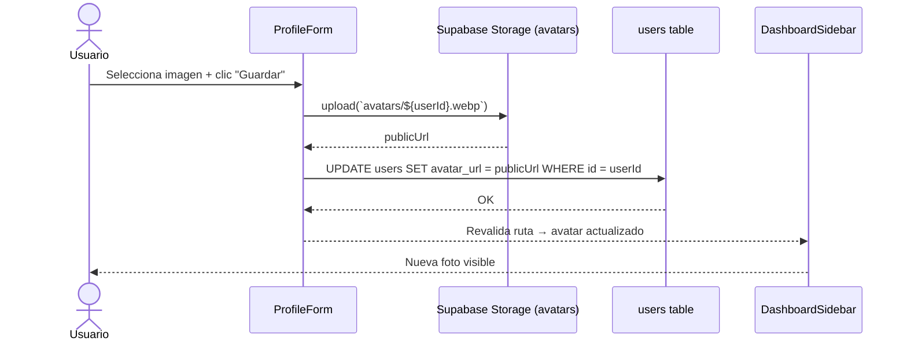

# Issue #44 — Perfil de Usuario: Avatar y Nombre Editable

**Milestone:** v0.6 — Perfil & Colaboración
**Branch:** `feat/issue-44-user-profile`
**Responsable:** Jefferson
**Labels:** `feature`, `backend`, `ui`
**Estado:** ⬜ Pendiente

---

## Historia de Usuario

Como usuario registrado en DBCanvas,
Quiero poder subir una foto de perfil y editar mi nombre desde una página de configuración,
Para que mis compañeros de proyecto me identifiquen visualmente al colaborar en tiempo real.

## Criterios de Aceptación

- [ ] Existe una ruta `/profile` con formulario para editar nombre `task`
- [ ] El usuario puede subir una foto que se almacena en Supabase Storage (bucket "avatars") `task`
- [ ] La columna `avatar_url` en la tabla `users` se actualiza tras subir la foto `task`
- [ ] El avatar aparece en el sidebar del dashboard y en los cursores del editor en tiempo real `task`
- [ ] Si no hay `avatar_url`, se muestra un avatar generado con las iniciales del nombre `task`

## Escenarios Gherkin

```gherkin
Escenario: Subir foto de perfil
  DADO que el usuario está en /profile
  CUANDO selecciona una imagen PNG o JPG y hace clic en "Guardar"
  ENTONCES la imagen se sube al bucket "avatars" de Supabase Storage
  Y avatar_url se actualiza en la tabla users
  Y el nuevo avatar aparece inmediatamente en el sidebar

Escenario: Avatar con iniciales como fallback
  DADO que un usuario no tiene avatar_url definido
  CUANDO otro colaborador ve la card del proyecto o el cursor en el editor
  ENTONCES se muestra un círculo con las iniciales del nombre (ej. "JP")
  Y el color de fondo se genera deterministamente desde el UUID del usuario
```

## Diagrama de Secuencia



---

## Notas de Implementación

- El campo `avatar_url` ya existe en la tabla `users` — no requiere migración
- Crear bucket público "avatars" en Supabase Storage → Settings → Storage
- Usar `supabase.storage.from('avatars').upload(path, file)` para subir
- Añadir RLS policy: usuarios autenticados pueden subir solo a su propio path (`avatars/${user.id}.*`)
- Redimensionar imagen client-side antes de subir (máx 256x256) para no desperdiciar storage
- El componente `AvatarImage` con fallback de iniciales debe ser reutilizable en sidebar, editor y cards
