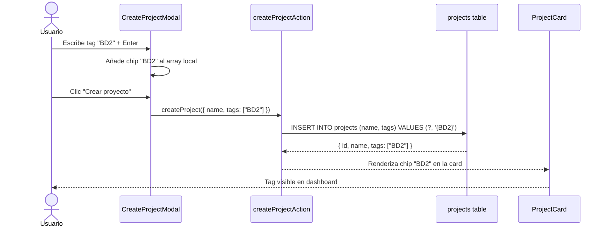

# Issue #45 — Tags y Categorías en Proyectos

**Milestone:** v0.6 — Perfil & Colaboración
**Branch:** `feat/issue-45-project-tags`
**Responsable:** Jefferson
**Labels:** `feature`, `backend`
**Estado:** ⬜ Pendiente

---

## Historia de Usuario

Como usuario con múltiples proyectos de diferentes áreas,
Quiero poder asignar etiquetas como "Comercial", "Inventario" o "BD2" a mis proyectos,
Para organizarlos visualmente y filtrarlos por categoría desde el dashboard.

## Criterios de Aceptación

- [ ] Se añade una columna `tags TEXT[]` a la tabla `projects` en Supabase `task`
- [ ] Al crear o editar un proyecto se pueden añadir tags con un input tipo chip `task`
- [ ] Cada card del proyecto muestra hasta 2 tags con colores diferenciados `task`
- [ ] El sidebar del dashboard incluye una sección de filtro por tag `task`
- [ ] La búsqueda del #43 también filtra por tags `task`

## Escenarios Gherkin

```gherkin
Escenario: Añadir tag al crear proyecto
  DADO que el usuario está creando un nuevo proyecto
  CUANDO escribe "Comercial" en el campo de tags y presiona Enter o coma
  ENTONCES el tag "Comercial" aparece como chip removible en el formulario
  Y al guardar, se almacena en projects.tags como array

Escenario: Filtrar por tag desde sidebar
  DADO que existen proyectos con tags "Comercial" e "Inventario"
  CUANDO el usuario hace clic en "Comercial" en la sección Tags del sidebar
  ENTONCES solo se muestran los proyectos que contienen ese tag
  Y el filtro se combina con la búsqueda por nombre
```

## Diagrama de Secuencia



---

## Notas de Implementación

- Migración SQL requerida:
  ```sql
  ALTER TABLE public.projects ADD COLUMN IF NOT EXISTS tags TEXT[] DEFAULT '{}';
  ```
- Actualizar `schema.ts` de Drizzle: `tags: text('tags').array().default([])`
- El input de tags debe aceptar Enter y coma como separadores
- Paleta de colores para tags (hash del texto):
  `['#1A6CF6','#10B981','#8B5CF6','#F59E0B','#EF4444','#06B6D4']`
- Mostrar máximo 2 tags en la card + badge "+N" si hay más
