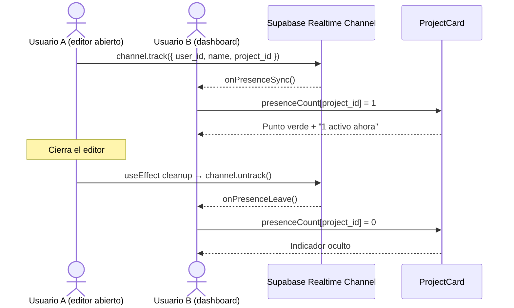

# Issue #46 — Indicadores de Presencia en Tiempo Real

**Milestone:** v0.6 — Perfil & Colaboración
**Branch:** `feat/issue-46-presence-indicators`
**Responsable:** Jefferson
**Labels:** `feature`, `realtime`
**Estado:** ⬜ Pendiente

---

## Historia de Usuario

Como colaborador en un proyecto compartido,
Quiero ver en el dashboard cuántos compañeros están activos en este momento en cada proyecto,
Para saber si alguien está trabajando antes de abrirlo y coordinar mejor la colaboración.

## Criterios de Aceptación

- [ ] Las cards del dashboard muestran un punto verde pulsante si hay colaboradores activos `task`
- [ ] El indicador de presencia usa Supabase Realtime Presence channel por proyecto `task`
- [ ] La toolbar del editor muestra los avatares de colaboradores activos en tiempo real `task`
- [ ] Al cerrar el editor, la presencia se elimina automáticamente (cleanup en useEffect) `task`
- [ ] El indicador desaparece del dashboard de los demás al salir `task`

## Escenarios Gherkin

```gherkin
Escenario: Ver colaborador activo en dashboard
  DADO que el Usuario A tiene abierto el proyecto "Ventas"
  CUANDO el Usuario B ve el dashboard
  ENTONCES la card de "Ventas" muestra un punto verde pulsante
  Y el texto "1 activo ahora" aparece debajo de los avatares

Escenario: Limpieza de presencia al salir del editor
  DADO que el usuario tiene el editor abierto y su presencia está activa
  CUANDO cierra la pestaña o navega a otra ruta
  ENTONCES Supabase Realtime elimina automáticamente su entrada de presencia
  Y el indicador desaparece del dashboard de los demás colaboradores
```

## Diagrama de Secuencia



---

## Notas de Implementación

- Usar `supabase.channel('presence:${projectId}')` con `.on('presence', { event: 'sync' }, callback)`
- El `channel.track()` se llama en el `useEffect` del editor al montar
- El cleanup `channel.untrack()` y `supabase.removeChannel()` va en el return del `useEffect`
- En el dashboard: suscribirse a todos los canales de los proyectos del usuario (o usar un canal global con filtro por project_id)
- El punto verde pulsante usa `@keyframes pulse` ya disponible en Tailwind
- No requiere cambios en la BD — es estado efímero en memoria de Supabase Realtime
